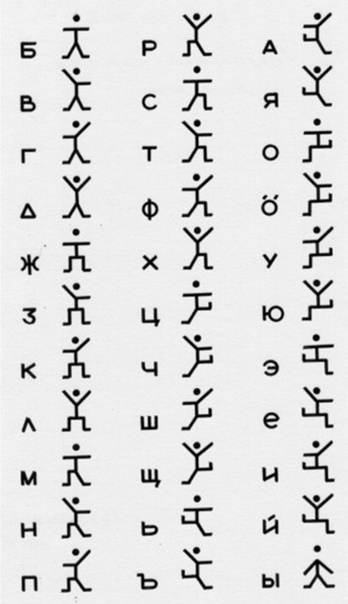
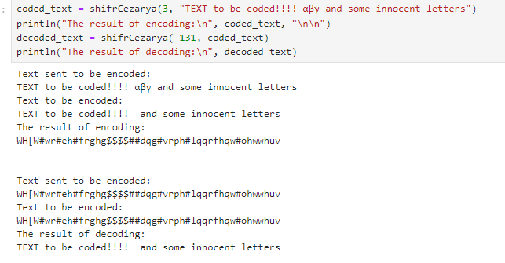
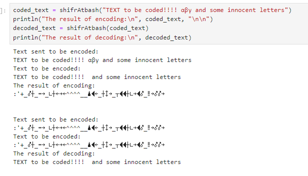

---
## Front matter
lang: ru-RU
title: "Лабораторная работа №1: Шифры простой замены"
subtitle: "Дисциплина: Математические основы защиты информации и информационной безопасности"
author: Манаева Варвара Евгеньевна, НФИмд-01-24, 1132249514
institute: Российский университет дружбы народов, Москва, Россия
date: 14 сентября 2024

## i18n babel
babel-lang: russian
babel-otherlangs: english

## Formatting pdf
toc: false
toc-title: Содержание
slide_level: 2
aspectratio: 169
section-titles: true
theme: metropolis
header-includes:
 - \metroset{progressbar=frametitle,sectionpage=progressbar,numbering=fraction}
---

## Цель работы

Ознакомиться с классическими примерами шифров простой замены.

## Задание

1. Реализовать шифр Цезаря с произвольным ключом $k$;
2. Реализовать шифр Атбаш.

# Теоретическое введение

## Виды шифров

:::::::::::::: {.columns align=center}
::: {.column width="50%"}

Шифры подразделяются на:

- Симметричные;
- Асимметричные.

:::
::: {.column width="50%"}


:::
::::::::::::::

## Виды симметричных шифров

:::::::::::::: {.columns align=center}
::: {.column width="50%"}


:::
::: {.column width="50%"}

Среди симметричных шифров выделяют:

- Шифры перестановки;
- Шифры подстановки.

:::
::::::::::::::

## Шифры подстановки

:::::::::::::: {.columns align=center}
::: {.column width="50%"}

Шифры подстановки подразделяются на:

- Моноалфавитные шифры;
- Многоалфавитные шифры.

:::
::: {.column width="50%"}



:::
::::::::::::::

## Шифр Цезаря и шифр Атбаш в сравнении

:::::::::::::: {.columns align=center}
::: {.column width="50%"}

Сходства:

- Моноалфавитные шифры.

:::
::: {.column width="50%"}

Различия:

- Шифр Цезаря использует смещение по кольцу;
- Шифр Атбаш использует зеркальное отражение алфавита.
 
:::
::::::::::::::

# Выполнение лабораторной работы

## 1. Реализация шифра Цезаря для произвольного ключа $k$

```julia
function shifrCezarya(k::Integer, text::AbstractString)::AbstractString
    k = mod(k, 128)
    println("Text sent to be encoded:\n", text)
    t = filter(isascii,text)
    println("Text to be encoded:\n", t)
    temp = only.(split(t,""))
    for i in 1:length(temp)
        temp[i] = Char(mod(k+Int(temp[i]), 128))
    end
    t = ""
    for i in 1:length(temp)
        t *= string(temp[i])
    end
    return t
end
```

## Результат выполнения пункта 1

```julia
coded_text = shifrCezarya(3, "TEXT to be coded!!!! αβγ and some innocent letters")
println("The result of encoding:\n", coded_text, "\n\n")
decoded_text = shifrCezarya(-131, coded_text)
println("The result of decoding:\n", decoded_text)
```


{width=70%}

## 2. Реализация шифра Атбаш

```julia
function shifrAtbash(text::AbstractString)::AbstractString
    println("Text sent to be encoded:\n", text)
    t = filter(isascii,text)
    println("Text to be encoded:\n", t)
    temp = only.(split(t,""))
    for i in 1:length(temp)
        temp[i] = Char(127-Int(temp[i]))
    end
    t = ""
    for i in 1:length(temp)
        t *= string(temp[i])
    end
    return t
end
```

## Результат выполнения пункта 2

```julia
coded_text = shifrAtbash("TEXT to be coded!!!! αβγ and some innocent letters")
println("The result of encoding:\n", coded_text, "\n\n")
decoded_text = shifrAtbash(coded_text)
println("The result of decoding:\n", decoded_text)
```

{width=70%}


# Выводы по проделанной работе

## Вывод

В результате работы мы ознакомились с традиционными моноалфавитными шрифтами простой замены, а именно: 

- Шифром Цезаря;
- Шифром Атбаш.

Были записаны скринкасты:

- выполнения лабораторной работы;
- создания отчёта по результатам выполения лабораторной работы;
- создания презентации по результатам выполнения лабораторной работы;
- защиты лабораторной работы.