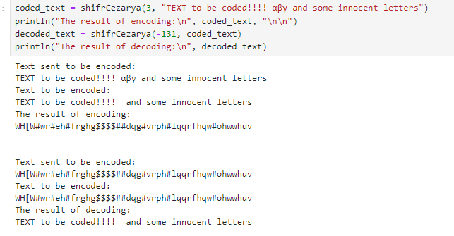
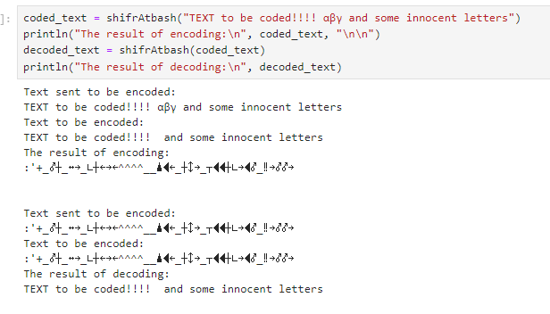

---
## Front matter
title: "Отчёт по лабораторной работе №1: Шифры простой замены"
subtitle: "Дисциплина: Математические основы защиты информации и информационной безопасности"
author: "Манаева Варвара Евгеньевна"

## Generic otions
lang: ru-RU
toc-title: "Содержание"

## Bibliography
bibliography: bib/cite.bib
csl: pandoc/csl/gost-r-7-0-5-2008-numeric.csl

## Pdf output format
toc: true # Table of contents
toc-depth: 2
lof: true # List of figures
lot: false # List of tables
fontsize: 12pt
linestretch: 1.5
papersize: a4
documentclass: scrreprt
## I18n polyglossia
polyglossia-lang:
  name: russian
  options:
	- spelling=modern
	- babelshorthands=true
polyglossia-otherlangs:
  name: english
## I18n babel
babel-lang: russian
babel-otherlangs: english
## Fonts
mainfont: IBM Plex Serif
romanfont: IBM Plex Serif
sansfont: IBM Plex Sans
monofont: IBM Plex Mono
mathfont: STIX Two Math
mainfontoptions: Ligatures=Common,Ligatures=TeX,Scale=0.94
romanfontoptions: Ligatures=Common,Ligatures=TeX,Scale=0.94
sansfontoptions: Ligatures=Common,Ligatures=TeX,Scale=MatchLowercase,Scale=0.94
monofontoptions: Scale=MatchLowercase,Scale=0.94,FakeStretch=0.9
mathfontoptions:
## Biblatex
biblatex: true
biblio-style: "gost-numeric"
biblatexoptions:
  - parentracker=true
  - backend=biber
  - hyperref=auto
  - language=auto
  - autolang=other*
  - citestyle=gost-numeric
## Pandoc-crossref LaTeX customization
figureTitle: "Рис."
tableTitle: "Таблица"
listingTitle: "Листинг"
lofTitle: "Список иллюстраций"
lotTitle: "Список таблиц"
lolTitle: "Листинги"
## Misc options
indent: true
header-includes:
  - \usepackage{indentfirst}
  - \usepackage{float} # keep figures where there are in the text
  - \floatplacement{figure}{H} # keep figures where there are in the text
---

# Общая информация о задании лабораторной работы

## Цель работы

Ознакомиться с классическими примерами шифров простой замены.

## Задание [@lab-task]

1. Реализовать шифр Цезаря с произвольным ключом $k$;
2. Реализовать шифр Атбаш.

# Теоретическое введение [@infobez-course]

## Шифры и симметричные шифры

Первоначальное сообщение от одного пользователя к другому названо исходным текстом; сообщение, передаваемое через канал, названо зашифрованным текстом.
Чтобы создать зашифрованный текст из исходного текста, отправитель использует алгоритм шифрования и совместный ключ засекречивания.
Для того чтобы создать обычный текст из зашифрованного текста, получатель использует алгоритм дешифрования и тот же секретный ключ.
Мы будем называть совместное действие алгоритмов шифрования и дешифрования шифровкой. Ключ — набор значений (чисел), которыми оперируют алгоритмы шифрования и дешифрования.

Обратите внимание, что шифрование симметричными ключами использует единственный ключ (ключ, содержащий непосредственно набор кодируемых значений)
и для кодирования и для дешифрования. Кроме того, алгоритмы шифрования и дешифрования — инверсии друг друга.
Если $P$ — обычный текст, $C$ — зашифрованный текст, а $K$ — ключ, алгоритм кодирования $E_k(x)$ создает зашифрованный текст из исходного текста.

Алгоритм же дешифрования Dk (x) создает исходный текст из зашифрованного текста.
Мы предполагаем, что $E_k(x)$ и $D_k(x)$ обратны друг другу.
Они применяются, последовательно преобразуя информацию из одного вида в другой и обратно.

## Шифры простой замены

Мы можем разделить традиционные шифры с симметричным ключом на две обширные категории: шифры подстановки и шифры перестановки.
В шифре подстановки мы заменяем один символ в зашифрованном тексте на другой символ; в шифре перестановки — меняем местами позиции символов в исходном тексте.

Шифры простой замены относятся к шифрам подстановки.

### Моноалфавитные шифры

Сначала обсудим шифры подстановки, называемые моноалфавитными шифрами. В такой подстановке буква (или символ) в исходном
тексте всегда изменяется на одну и ту же самую букву (или символ) в зашифрованном тексте независимо от его позиции в тексте.
Например, если алгоритм определяет, что буква A в исходном тексте меняется на букву D, то при этом каждая буква A изменяется на букву D.
Другими словами, буквы в исходном тексте и зашифрованном тексте находятся в отношении один к одному.

В моноалфавитной подстановке отношения между буквой в исходном тексте и буквой в зашифрованном тексте — один к одному.

#### Аддитивные шифры

Самый простой моноалфавитный шифр — аддитивный шифр, его иногда называют шифром сдвига, а иногда — шифром Цезаря, но термин аддитивный шифр лучше показывает его математический смысл.
Предположим, что исходный текст состоит из маленьких букв (от a до z) и зашифрованный текст состоит из заглавных букв (от A до Z).
Чтобы обеспечить применение математических операций к исходному и зашифрованному текстам, мы присвоим каждой букве числовое значение (для нижнего и верхнего регистра).

Каждому символу (нижний регистр или верхний регистр) сопоставлено целое число из кольца $Z_{26}$.
Ключ засекречивания между отправителем и получателем — также целое число в кольце $Z_n$.
Алгоритм кодирования прибавляет ключ к символу исходного текста; алгоритм дешифрования вычитает ключ из символа зашифрованного текста.
Все операции проводятся в кольце $Z_n$.

##### Шифр сдвига

Исторически аддитивные шифры назывались шифрами сдвига — по той причине, что алгоритм шифрования может интерпретироваться как "клавиша сдвига буквы вниз",
а алгоритм дешифрования может интерпретироваться как "клавиши сдвига буквы вверх". Например, если ключ = 15, алгоритм кодирования сдвигает букву на 15 букв вниз
(к концу алфавита). Алгоритм дешифрования сдвигает букву на 15 букв вверх (к началу алфавита). Конечно, когда мы достигаем конца или начала алфавита, мы двигаемся
по кольцу к началу (объявленные свойства операции по модулю 26).

##### Шифр Цезаря

Юлий Цезарь использовал аддитивный шифр, чтобы связаться со своими чиновниками. По этой причине аддитивные шифры упоминаются иногда как шифры
Цезаря. Цезарь для своей связи использовал цифру 3.

### Шифр Атбаш

Шифр Атбаш также является моноалфавитным шифром, однако отличается от шифра Цезаря. Принцип его работы основан на том, что для шифровки сообщения необходимо зеркально отразить алфавит,
использующийся при написании этого сообщения. Таким образом, шифр перемещает между собой все символы алфавита (или почти все в алфавитах с нечётным числом символом).

# Выполнение лабораторной работы [@lab-task]

## 1. Реализация шифра Цезаря для произвольного ключа $k$

Для реализации шифра Цезаря необходимо было ограничить алфавит. В тексте лабораторной работы [@lab-task] предложен пример использования исключительно латиницы.
В своей реализации я предлагаю использовать в качестве алфавита все символы ASCII, которые доступны в `Julia` [@doc-julia].

В языке `Julia` число ASCII символов ограничено $128$ [@doc-julia:Char], в связи с чем при реализации использовалась формула `mod(Int(symbol)+k, 128)` для преобразования каждого символа `symbol`,
где $k$ -- смещение, задаваемое в качестве параметра функции.

```julia
function shifrCezarya(k::Integer, text::AbstractString)::AbstractString
    k = mod(k, 128)
    println("Text sent to be encoded:\n", text)
    t = filter(isascii,text)
    println("Text to be encoded:\n", t)
    temp = only.(split(t,""))
    for i in 1:length(temp)
        temp[i] = Char(mod(k+Int(temp[i]), 128))
    end
    t = ""
    for i in 1:length(temp)
        t *= string(temp[i])
    end
    return t
end
```

При проверке правильности реализации важно учитывать, что шифры простой замены (а, значит, и шифр Цезаря) относятся к симметричным шифрам.
Шифр Цезаря симметричен относительно размера своего алфавита: для расшифровки сообщений необходимо использовать индентичный алфавит, однако при расшифровке 
необходимо использовать значение параметра $k_{decoder}=alphabet\,length \hspace{5pt}-\hspace{5pt} k_{encoder}$.
Это важно при проверке правильности работы шифра, для чего изначальное сообщение мы пропускаем дважды через функцию, которая зашифровывает сообщение.
Так мы должны получить шифрокод после первого запуска функции, и изначальное сообщение после второго запуска функции

```julia
coded_text = shifrCezarya(3, "TEXT to be coded!!!! αβγ and some innocent letters")
println("The result of encoding:\n", coded_text, "\n\n")
decoded_text = shifrCezarya(-131, coded_text)
println("The result of decoding:\n", decoded_text)
```

Результат работы кода представлен ниже (рис. [-@fig:001]).

{#fig:001 width=70%}

## 2. Реализация шифра Атбаш

Для реализации шифра Атбаш необходимо было ограничить алфавит. В тексте лабораторной работы [@lab-task] предложен пример на языке `Pascal`, в котором алфавит символов ограничен 256 символами ASCII.

В языке `Julia` число ASCII символов ограничено $128$ [@doc-julia:Char], в связи с чем при реализации использовалась формула `127-Int(symbol)` для преобразования каждого символа `symbol`.

```julia
function shifrAtbash(text::AbstractString)::AbstractString
    println("Text sent to be encoded:\n", text)
    t = filter(isascii,text)
    println("Text to be encoded:\n", t)
    temp = only.(split(t,""))
    for i in 1:length(temp)
        temp[i] = Char(127-Int(temp[i]))
    end
    t = ""
    for i in 1:length(temp)
        t *= string(temp[i])
    end
    return t
end
```

Для ограничения числа символов, с которыми ведётся работа, до алфавита из $128$ ASCII символов, реализованных в Julia, на вводимый текст перед зашифровкой применяется фильтр,
который пропускает исключительно символы ASCII и отбрасывает посторонние символы. После этого дополнительно пользователю демонстрируется фраза, которая получилась после
фильтрации посторонних символов.

При проверке правильности реализации важно учитывать, что шифры простой замены (а, значит, и шифр Атбаш) относятся к симметричным шифрам.
Причём шифр Атбаш, в отличие от уже разобранного шифра Цезаря, симметричен только с учётом идентичности алфавита при шифровании и дешифровании.
Это важно при проверке правильности работы шифра, для чего изначальное сообщение мы пропускаем дважды через функцию, которая зашифровывает сообщение.
Так мы должны получить шифрокод после первого запуска функции, и изначальное сообщение после второго запуска функции.

```julia
coded_text = shifrAtbash("TEXT to be coded!!!! αβγ and some innocent letters")
println("The result of encoding:\n", coded_text, "\n\n")
decoded_text = shifrAtbash(coded_text)
println("The result of decoding:\n", decoded_text)
```

Результат работы кода представлен ниже (рис. [-@fig:002]).

{#fig:002 width=70%}

# Выводы

В результате работы мы ознакомились с традиционными моноалфавитными шрифтами простой замены, а именно: 

- Шифром Цезаря;
- Шифром Атбаш.

Также были записаны скринкасты:

- [Выполнения лабораторной работы](https://rutube.ru/video/ec91c9ff836f7967482d5b272fe9bf58/)
- [Запись создания отчёта](https://rutube.ru/video/5de97e1e76e764109d0181b30dd1cd34/)
- [Запись создания презентации](https://rutube.ru/video/9dfb50ad9a435334fb9b75475dc50750/)
- [Защита лабораторной работы](https://rutube.ru/video/7471ffd5c324c3c5ed3a431570f5aada/)

# Список литературы{.unnumbered}

::: {#refs}
:::
