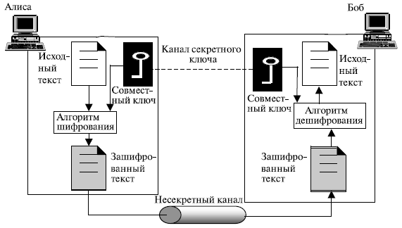
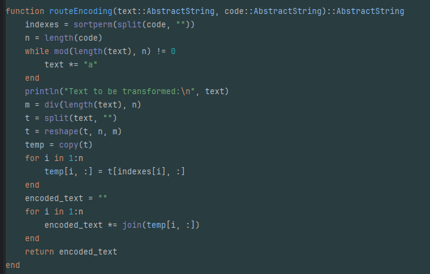
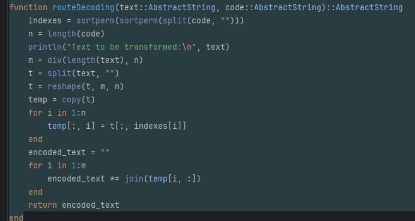
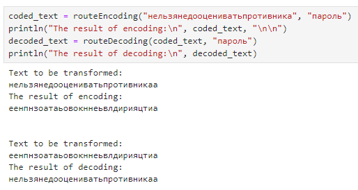
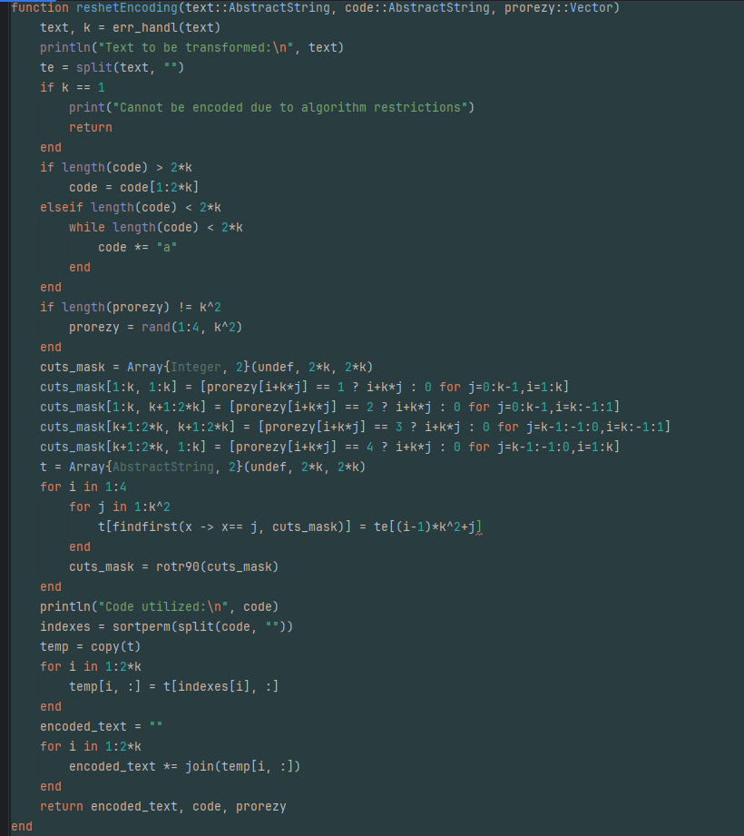
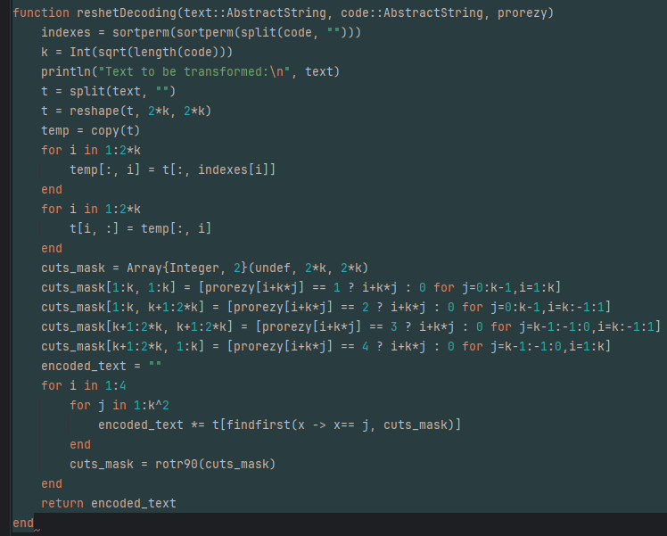
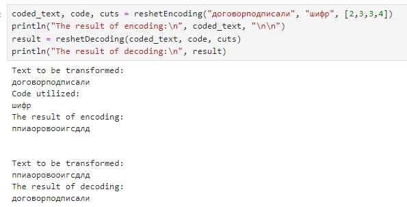
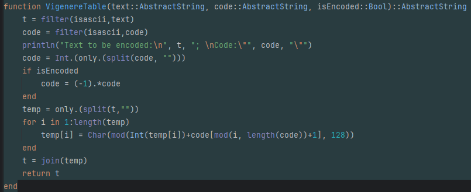
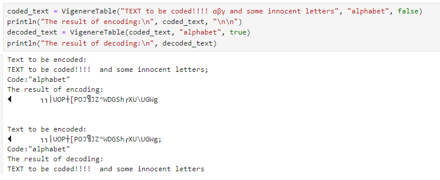

---
## Front matter
lang: ru-RU
title: "Лабораторная работа №2: Шифры перестановки"
subtitle: "Дисциплина: Математические основы защиты информации и информационной безопасности"
author: Манаева Варвара Евгеньевна, НФИмд-01-24, 1132249514
institute: Российский университет дружбы народов, Москва, Россия
date: 28 сентября 2024

## i18n babel
babel-lang: russian
babel-otherlangs: english

## Formatting pdf
toc: false
toc-title: Содержание
slide_level: 2
aspectratio: 169
section-titles: true
theme: metropolis
header-includes:
 - \metroset{progressbar=frametitle,sectionpage=progressbar,numbering=fraction}
---

## Цель работы

Ознакомиться с классическими примерами шифров перестановки.

## Задание

1. Реализовать шифры, представленные в задании.

# Теоретическое введение

## Виды шифров

:::::::::::::: {.columns align=center}
::: {.column width="50%"}

Шифры подразделяются на:

- Симметричные;
- Асимметричные.

:::
::: {.column width="50%"}

:::
::::::::::::::

## Виды симметричных шифров

:::::::::::::: {.columns align=center}
::: {.column width="50%"}

:::
::: {.column width="50%"}

Среди симметричных шифров выделяют:

- Шифры перестановки;
- Шифры подстановки.

:::
::::::::::::::

# Выполнение лабораторной работы

## Реализация маршрутного шифрования (1)

{width=70%}

## Реализация маршрутного шифрования (2)

{width=70%}

## Результат работы кода для маршрутного шифрования

{width=70%}

## Реализация шифрования с помощью решёток (1.1)

{width=70%}

## Реализация шифрования с помощью решёток (1.2)

{width=70%}

## Реализация шифрования с помощью решёток (2)

{width=70%}

## Результат работы кода для шифрования с помощью решёток

{width=70%}

## Реализация таблиц Виженера (1)

{width=70%}

## Реализация таблиц Виженера (2)

{width=70%}

## Результат работы кода для таблиц Виженера

{width=70%}

# Выводы по проделанной работе

## Вывод

В результате работы мы ознакомились с традиционными моноалфавитными шрифтами простой замены, а именно: 

- Маршрутным шифрованием;
- Шифрованием с помощью решёток;
- Таблицами Виженера.

Были записаны скринкасты:

- выполнения лабораторной работы;
- создания отчёта по результатам выполения лабораторной работы;
- создания презентации по результатам выполнения лабораторной работы;
- защиты лабораторной работы.