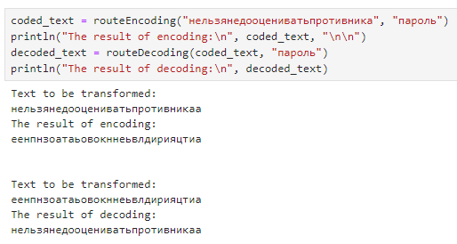
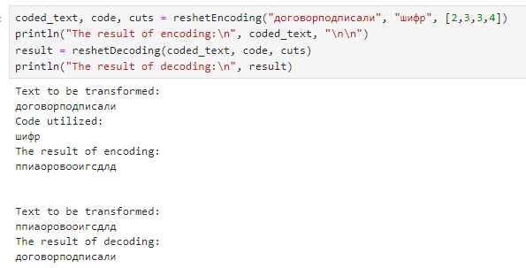
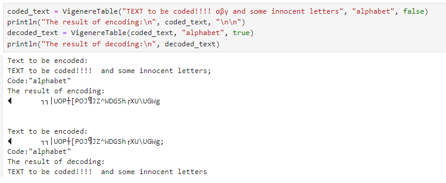

---
## Front matter
title: "Отчёт по лабораторной работе №2: Шифры перестановки"
subtitle: "Дисциплина: Математические основы защиты информации и информационной безопасности"
author: "Манаева Варвара Евгеньевна"

## Generic otions
lang: ru-RU
toc-title: "Содержание"

## Bibliography
bibliography: bib/cite.bib
csl: pandoc/csl/gost-r-7-0-5-2008-numeric.csl

## Pdf output format
toc: true # Table of contents
toc-depth: 2
lof: true # List of figures
lot: false # List of tables
fontsize: 12pt
linestretch: 1.5
papersize: a4
documentclass: scrreprt
## I18n polyglossia
polyglossia-lang:
  name: russian
  options:
	- spelling=modern
	- babelshorthands=true
polyglossia-otherlangs:
  name: english
## I18n babel
babel-lang: russian
babel-otherlangs: english
## Fonts
mainfont: IBM Plex Serif
romanfont: IBM Plex Serif
sansfont: IBM Plex Sans
monofont: IBM Plex Mono
mathfont: STIX Two Math
mainfontoptions: Ligatures=Common,Ligatures=TeX,Scale=0.94
romanfontoptions: Ligatures=Common,Ligatures=TeX,Scale=0.94
sansfontoptions: Ligatures=Common,Ligatures=TeX,Scale=MatchLowercase,Scale=0.94
monofontoptions: Scale=MatchLowercase,Scale=0.94,FakeStretch=0.9
mathfontoptions:
## Biblatex
biblatex: true
biblio-style: "gost-numeric"
biblatexoptions:
  - parentracker=true
  - backend=biber
  - hyperref=auto
  - language=auto
  - autolang=other*
  - citestyle=gost-numeric
## Pandoc-crossref LaTeX customization
figureTitle: "Рис."
tableTitle: "Таблица"
listingTitle: "Листинг"
lofTitle: "Список иллюстраций"
lotTitle: "Список таблиц"
lolTitle: "Листинги"
## Misc options
indent: true
header-includes:
  - \usepackage{indentfirst}
  - \usepackage{float} # keep figures where there are in the text
  - \floatplacement{figure}{H} # keep figures where there are in the text
---

# Общая информация о задании лабораторной работы

## Цель работы

Ознакомиться с классическими примерами шифров перестановки.

## Задание [@lab-task]

1. Реализовать шифры из задания.

# Теоретическое введение [@infobez-course]

## Шифры и симметричные шифры

Первоначальное сообщение от одного пользователя к другому названо исходным текстом; сообщение, передаваемое через канал, названо зашифрованным текстом.
Чтобы создать зашифрованный текст из исходного текста, отправитель использует алгоритм шифрования и совместный ключ засекречивания.
Для того чтобы создать обычный текст из зашифрованного текста, получатель использует алгоритм дешифрования и тот же секретный ключ.
Мы будем называть совместное действие алгоритмов шифрования и дешифрования шифровкой. Ключ — набор значений (чисел), которыми оперируют алгоритмы шифрования и дешифрования.

Обратите внимание, что шифрование симметричными ключами использует единственный ключ (ключ, содержащий непосредственно набор кодируемых значений)
и для кодирования и для дешифрования. Кроме того, алгоритмы шифрования и дешифрования — инверсии друг друга.
Если $P$ — обычный текст, $C$ — зашифрованный текст, а $K$ — ключ, алгоритм кодирования $E_k(x)$ создает зашифрованный текст из исходного текста.

Алгоритм же дешифрования Dk (x) создает исходный текст из зашифрованного текста.
Мы предполагаем, что $E_k(x)$ и $D_k(x)$ обратны друг другу.
Они применяются, последовательно преобразуя информацию из одного вида в другой и обратно.

# Выполнение лабораторной работы [@lab-task]

## Шифр 1

Маршрутное шифрование включает в себя несколько преобразований изначального текста для корректной шифровки и расшифровки. 
Из-за некоторых особенностей встроенной функции `reshape(array, dims...)` в `Julia` некоторые функции приходилось дополнительно прописывать транспонирование матрицы получавшихся символов текста.

```julia
function routeEncodingIncorrect(text::AbstractString, code::AbstractString, isToEncode::Bool)::AbstractString
    indexes = sortperm(split(code, ""))
    n = length(code)
    if !isToEncode
        indexes = sortperm(indexes)
    end
    while mod(length(text), n) != 0
        text *= "а"
    end
    println("Text to be encoded:\n", text)
    m = div(length(text), n)
    t = split(text, "")
    t = reshape(t, n, m)
    for i in 1:m
        t[:, i] = t[indexes, i]
    end
    encoded_text = join(t)
    return encoded_text
end

function routeEncoding(text::AbstractString, code::AbstractString)::AbstractString
    indexes = sortperm(split(code, ""))
    n = length(code)
    while mod(length(text), n) != 0
        text *= "а"
    end
    println("Text to be transformed:\n", text)
    m = div(length(text), n)
    t = split(text, "")
    t = reshape(t, n, m)
    temp = copy(t)
    for i in 1:n
        temp[i, :] = t[indexes[i], :]
    end
    encoded_text = ""
    for i in 1:n
        encoded_text *= join(temp[i, :])
    end
    return encoded_text
end

function routeDecoding(text::AbstractString, code::AbstractString)::AbstractString
    indexes = sortperm(sortperm(split(code, "")))
    n = length(code)
    println("Text to be transformed:\n", text)
    m = div(length(text), n)
    t = split(text, "")
    t = reshape(t, m, n)
    temp = copy(t)
    for i in 1:n
        temp[:, i] = t[:, indexes[i]]
    end
    encoded_text = ""
    for i in 1:m
        encoded_text *= join(temp[i, :])
    end
    return encoded_text
end
```

При проверке правильности реализации важно учитывать, что шифры перестановки (а, значит, и маршрутное шифрование) относятся к симметричным шифрам.
Это важно при проверке правильности работы шифра, для чего изначальное сообщение мы пропускаем через функции шифровки и расшифровки с одними и теми же параметрами
(в частности, если параметры были изменены в функции шифровки для соответствия алгоритму, они выводились дополнительными переменными в результате выполнения функции).
Так мы должны получить шифрокод после запуска функции шифровки, и изначальное сообщение после запуска функции расшифровки с теми же дополнительными параметрами на входе.

```julia
coded_text = routeEncoding("нельзянедооцениватьпротивника", "пароль")
println("The result of encoding:\n", coded_text, "\n\n")
decoded_text = routeDecoding(coded_text, "пароль")
println("The result of decoding:\n", decoded_text)
```

Результат работы кода представлен ниже (рис. [-@fig:001]).

{#fig:001 width=70%}

## Шифрование с помощью решёток

Для реализации шифрования с помощью решёток использовались множество функций для работы с массивами, такие как `findfirst(x::function, array)`, `rotr90(A[, k])` и `rotl90(A[, k])`,
классический конструктор массива `Array{Type, N_of_dims}(undef, dims...)` и прочие [@doc-julia].

```julia
using Random
function err_handl(text)
    check = false
    while !check
        try 
            Int(sqrt(length(text))/2)
        catch
            text *= "a"
        else
            check = true
        end
    end
    return text, Int(sqrt(length(text))/2)
end

function reshetEncoding(text::AbstractString, code::AbstractString, prorezy::Vector)
    text, k = err_handl(text)
    println("Text to be transformed:\n", text)
    te = split(text, "")
    if k == 1
        print("Cannot be encoded due to algorithm restrictions")
        return
    end
    if length(code) > 2*k
        code = code[1:2*k]
    elseif length(code) < 2*k
        while length(code) < 2*k
            code *= "a"
        end
    end
    if length(prorezy) != k^2
        prorezy = rand(1:4, k^2)
    end
    cuts_mask = Array{Integer, 2}(undef, 2*k, 2*k)
    cuts_mask[1:k, 1:k] = [prorezy[i+k*j] == 1 ? i+k*j : 0 for j=0:k-1,i=1:k]
    cuts_mask[1:k, k+1:2*k] = [prorezy[i+k*j] == 2 ? i+k*j : 0 for j=0:k-1,i=k:-1:1]
    cuts_mask[k+1:2*k, k+1:2*k] = [prorezy[i+k*j] == 3 ? i+k*j : 0 for j=k-1:-1:0,i=k:-1:1]
    cuts_mask[k+1:2*k, 1:k] = [prorezy[i+k*j] == 4 ? i+k*j : 0 for j=k-1:-1:0,i=1:k]
    t = Array{AbstractString, 2}(undef, 2*k, 2*k)
    for i in 1:4
        for j in 1:k^2
            t[findfirst(x -> x== j, cuts_mask)] = te[(i-1)*k^2+j]
        end
        cuts_mask = rotr90(cuts_mask)
    end
    println("Code utilized:\n", code)
    indexes = sortperm(split(code, ""))
    temp = copy(t)
    for i in 1:2*k
        temp[i, :] = t[indexes[i], :]
    end
    encoded_text = ""
    for i in 1:2*k
        encoded_text *= join(temp[i, :])
    end
    return encoded_text, code, prorezy
end

function reshetDecoding(text::AbstractString, code::AbstractString, prorezy)
    indexes = sortperm(sortperm(split(code, "")))
    k = Int(sqrt(length(code)))
    println("Text to be transformed:\n", text)
    t = split(text, "")
    t = reshape(t, 2*k, 2*k)
    temp = copy(t)
    for i in 1:2*k
        temp[:, i] = t[:, indexes[i]]
    end
    for i in 1:2*k
        t[i, :] = temp[:, i]
    end
    cuts_mask = Array{Integer, 2}(undef, 2*k, 2*k)
    cuts_mask[1:k, 1:k] = [prorezy[i+k*j] == 1 ? i+k*j : 0 for j=0:k-1,i=1:k]
    cuts_mask[1:k, k+1:2*k] = [prorezy[i+k*j] == 2 ? i+k*j : 0 for j=0:k-1,i=k:-1:1]
    cuts_mask[k+1:2*k, k+1:2*k] = [prorezy[i+k*j] == 3 ? i+k*j : 0 for j=k-1:-1:0,i=k:-1:1]
    cuts_mask[k+1:2*k, 1:k] = [prorezy[i+k*j] == 4 ? i+k*j : 0 for j=k-1:-1:0,i=1:k]
    encoded_text = ""
    for i in 1:4
        for j in 1:k^2
            encoded_text *= t[findfirst(x -> x== j, cuts_mask)]
        end
        cuts_mask = rotr90(cuts_mask)
    end
    return encoded_text
end
```

При проверке правильности реализации важно учитывать, что шифры перестановки (а, значит, и шифрование с помощью решёток) относятся к симметричным шифрам.
Это важно при проверке правильности работы шифра, для чего изначальное сообщение мы пропускаем через функции шифровки и расшифровки с одними и теми же параметрами
(в частности, если параметры были изменены в функции шифровки для соответствия алгоритму, они выводились дополнительными переменными в результате выполнения функции).
Так мы должны получить шифрокод после запуска функции шифровки, и изначальное сообщение после запуска функции расшифровки с теми же дополнительными параметрами на входе.

```julia
coded_text, code, cuts = reshetEncoding("договорподписали", "шифр", [2,3,3,4])
println("The result of encoding:\n", coded_text, "\n\n")
result = reshetDecoding(coded_text, code, cuts)
println("The result of decoding:\n", result)
```

Результат работы кода представлен ниже (рис. [-@fig:002]).

{#fig:002 width=70%}

## Таблицы Виженера

Для реализации таблицы Виженера необходимо было ограничить алфавит. В тексте лабораторной работы [@lab-task] предложен пример использования исключительно латиницы.
В своей реализации я предлагаю использовать в качестве алфавита все символы ASCII, которые доступны в `Julia` [@doc-julia].

В языке `Julia` число ASCII символов ограничено $128$ [@doc-julia:Char], которые и были алфавитом в использованной реализации шифрования с помощью таблиц Виженера.

```julia
function VigenereTable(text::AbstractString, code::AbstractString, isEncoded::Bool)::AbstractString
    t = filter(isascii,text)
    code = filter(isascii,code)
    println("Text to be encoded:\n", t, "; \nCode:\"", code, "\"")
    code = Int.(only.(split(code, "")))
    if isEncoded
        code = (-1).*code
    end
    temp = only.(split(t,""))
    for i in 1:length(temp)
        temp[i] = Char(mod(Int(temp[i])+code[mod(i, length(code))+1], 128))
    end
    t = join(temp)
    return t
end
```

При проверке правильности реализации важно учитывать, что шифры перестановки (а, значит, и шифрование с помощью таблицы Виженера) относятся к симметричным шифрам.
Это важно при проверке правильности работы шифра, для чего изначальное сообщение мы пропускаем через функции шифровки и расшифровки с одними и теми же параметрами
(в частности, если параметры были изменены в функции шифровки для соответствия алгоритму, они выводились дополнительными переменными в результате выполнения функции).
Так мы должны получить шифрокод после запуска функции шифровки, и изначальное сообщение после запуска функции расшифровки с теми же дополнительными параметрами на входе.

```julia
coded_text = VigenereTable("TEXT to be coded!!!! αβγ and some innocent letters", "alphabet", false)
println("The result of encoding:\n", coded_text, "\n\n")
decoded_text = VigenereTable(coded_text, "alphabet", true)
println("The result of decoding:\n", decoded_text)
```

Результат работы кода представлен ниже (рис. [-@fig:003]).

{#fig:003 width=70%}

# Выводы

В результате работы мы ознакомились с традиционными моноалфавитными шрифтами простой замены, а именно: 

- Маршрутным шифрованием;
- Шифрованием с помощью решёток;
- Таблицами Виженера.

Также были записаны скринкасты:

На RuTube:

- [Весь плейлист](https://rutube.ru/plst/540770)
- [Выполнения лабораторной работы, часть 1](https://rutube.ru/video/10f37172e6c677ab27794fc40374c357)
- [Выполнения лабораторной работы, часть 2](https://rutube.ru/video/54382b0d694e12e25aa08a57c8801893)
- [Запись создания отчёта](https://rutube.ru/video/2620c9656b8ee7c3ab1c8784813b1904)
- [Запись создания презентации](https://rutube.ru/video/a67c8780c4ad31ebd371f5dc9188fdd0)
- [Защита лабораторной работы](https://rutube.ru/video/c0858c0cde854661e4cf9a98a3267598)

На Платформе:

- [Весь плейлист](https://plvideo.ru/playlist?list=vaNN02mO97J6)
- [Выполнения лабораторной работы, часть 1](https://plvideo.ru/watch?v=4Ces3XmW5SsX)
- [Выполнения лабораторной работы, часть 2](https://plvideo.ru/watch?v=zQvK3sfwqJA8)
- [Запись создания отчёта](https://plvideo.ru/watch?v=6LSqPhPtwkj5)
- [Запись создания презентации](https://plvideo.ru/watch?v=y2gwvx0xzRVl)
- [Защита лабораторной работы](https://plvideo.ru/watch?v=mpV0o8O6WOym)

# Список литературы{.unnumbered}

::: {#refs}
:::
