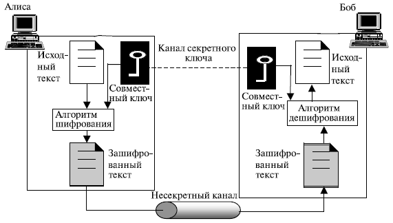
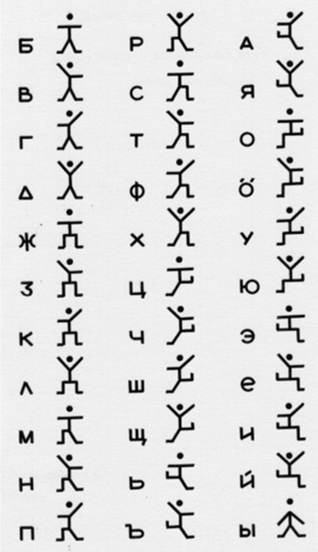
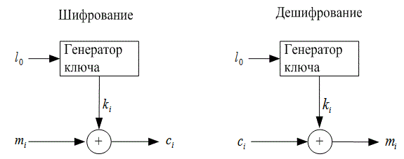
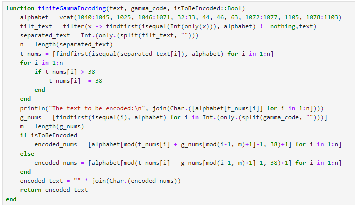
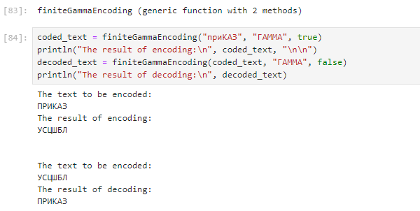

---
## Front matter
lang: ru-RU
title: "Лабораторная работа №3: Шифрование гаммированием"
subtitle: "Дисциплина: Математические основы защиты информации и информационной безопасности"
author: Манаева Варвара Евгеньевна, НФИмд-01-24, 1132249514
institute: Российский университет дружбы народов, Москва, Россия
date: 06 октября 2024

## i18n babel
babel-lang: russian
babel-otherlangs: english

## Formatting pdf
toc: false
toc-title: Содержание
slide_level: 2
aspectratio: 169
section-titles: true
theme: metropolis
header-includes:
 - \metroset{progressbar=frametitle,sectionpage=progressbar,numbering=fraction}
---

# Общая информация о лабораторной работе

## Цель работы

Ознакомиться с шифрованием гаммированием и его математическими основами.

## Задание

1. Реализовать шифрование гаммированием с конечной гаммой.

# Теоретическое введение

## Виды симметричных шифров

:::::::::::::: {.columns align=center}
::: {.column width="50%"}



:::
::: {.column width="50%"}

Среди симметричных шифров выделяют:

- Шифры перестановки;
- Шифры подстановки.

:::
::::::::::::::

## Шифры подстановки

:::::::::::::: {.columns align=center}
::: {.column width="50%"}

Шифры подстановки подразделяются на:

- Моноалфавитные шифры;
- Многоалфавитные шифры.

:::
::: {.column width="50%"}



:::
::::::::::::::

## Шифрование гаммированием




# Выполнение лабораторной работы

## Шифрование гаммированием с конечной гаммой

{#fig:002 width=70%}

## Работа функции (1)

Разберём подробно работу функции.

На вход функция принимает 3 параметра: 

- `text` -- исходный текст;
- `gamma_code` -- конечная гамма в виде кодового слова или фразы;
- `isToBeEncoded` -- переменная логического типа, изменяющая поведение работы функции в зависимости от того, был ли наш текст зашифрован до этого или нет.

## Работа функции (2)

Функцию саму можно поделить на несколько смысловых частей:

1. Предобработка данных исходного текста;
2. Предобработка гаммы;
3. Шифровка/расшифровка исходного текста;
4. Вывод функции.

## 1. Предобработка данных исходного текста

Предобработка исходного текста включает в себя фильтрацию от символов, не принадлежащих алфавиту, а также изменение регистра символов.

```julia
alphabet = vcat(1040:1045, 1025, 1046:1071, 32:33, 44, 46, 63, 1072:1077, 1105, 1078:1103)
filt_text = filter(x -> findfirst(isequal(Int(only(x))), alphabet) != nothing,text)
separated_text = Int.(only.(split(filt_text, "")))
n = length(separated_text)
t_nums = [findfirst(isequal(separated_text[i]), alphabet) for i in 1:n]
for i in 1:n
    if t_nums[i] > 38
        t_nums[i] -= 38
    end
end
println("The text to be encoded:\n", join(Char.([alphabet[t_nums[i]] for i in 1:n])))
# <...>
```

## 2. Предобработка гаммы

Предобработка исходного текста включает в себя преобразование гаммы в последовательность символов, которая затем переводится в числа.

```julia
# <...>
g_nums = [findfirst(isequal(i), alphabet) for i in Int.(only.(split(gamma_code, "")))]
m = length(g_nums)
# <...>
```

## 3. Шифровка/расшифровка исходного текста

Собственно шифровка/расшифровка исходного текста включает в себя сложение по модулю мощности алфавита символов гаммы и символов исходного текста.

```julia
# <...>
if isToBeEncoded
    encoded_nums = [alphabet[mod(t_nums[i] + g_nums[mod(i-1, m)+1]-1, 38)+1] for i in 1:n]
else
    encoded_nums = [alphabet[mod(t_nums[i] - g_nums[mod(i-1, m)+1]-1, 38)+1] for i in 1:n]
end
# <...>
``` 

## 4. Вывод функции

Для создания вывода функции вектор численных значений символов зашифрованного текста преобразуется в формат `Char`, 
после чего символы объединяются в единую строку и выводятся из функции.

```julia
# <...>
encoded_text = "" * join(Char.(encoded_nums))
return encoded_text
```

## Проверка работы функции

При проверке корректности реализации важно учитывать, что шифрование гаммированием относится к симметричным шифрам.
Для проверки изначальное сообщение мы пропускаем через функции шифровки и расшифровки с одними и теми же параметрами (кодовым словом, которое играет роль гаммы при шифровании).
Так мы должны получить шифрокод после запуска функции шифрования первый раз, и изначальное сообщение после запуска функции второй раз с теми же параметрами на входе
(исключая собственно параметр функции, задающий направление шифровки/расшифровки).

```julia
coded_text = finiteGammaEncoding("приКАЗ", "ГАММА", true)
println("The result of encoding:\n", coded_text, "\n\n")
decoded_text = finiteGammaEncoding(coded_text, "ГАММА", false)
println("The result of decoding:\n", decoded_text)
```

## Результат выполнения запуска функции шифрования

{#fig:001 width=70%}

# Выводы

В результате работы мы ознакомились со способом шифрования гаммированием и его математическими основами, а также реализовали шифрование гаммированием с конечной гаммой.

Были записаны скринкасты:

- выполнения лабораторной работы;
- создания отчёта по результатам выполения лабораторной работы;
- создания презентации по результатам выполнения лабораторной работы;
- защиты лабораторной работы.