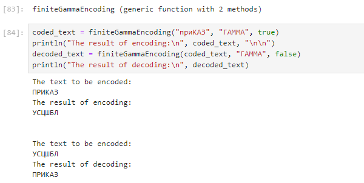

---
## Front matter
title: "Отчёт по лабораторной работе №2: Шифры перестановки"
subtitle: "Дисциплина: Математические основы защиты информации и информационной безопасности"
author: "Манаева Варвара Евгеньевна"

## Generic otions
lang: ru-RU
toc-title: "Содержание"

## Bibliography
bibliography: bib/cite.bib
csl: pandoc/csl/gost-r-7-0-5-2008-numeric.csl

## Pdf output format
toc: true # Table of contents
toc-depth: 2
lof: true # List of figures
lot: false # List of tables
fontsize: 12pt
linestretch: 1.5
papersize: a4
documentclass: scrreprt
## I18n polyglossia
polyglossia-lang:
  name: russian
  options:
	- spelling=modern
	- babelshorthands=true
polyglossia-otherlangs:
  name: english
## I18n babel
babel-lang: russian
babel-otherlangs: english
## Fonts
mainfont: IBM Plex Serif
romanfont: IBM Plex Serif
sansfont: IBM Plex Sans
monofont: IBM Plex Mono
mathfont: STIX Two Math
mainfontoptions: Ligatures=Common,Ligatures=TeX,Scale=0.94
romanfontoptions: Ligatures=Common,Ligatures=TeX,Scale=0.94
sansfontoptions: Ligatures=Common,Ligatures=TeX,Scale=MatchLowercase,Scale=0.94
monofontoptions: Scale=MatchLowercase,Scale=0.94,FakeStretch=0.9
mathfontoptions:
## Biblatex
biblatex: true
biblio-style: "gost-numeric"
biblatexoptions:
  - parentracker=true
  - backend=biber
  - hyperref=auto
  - language=auto
  - autolang=other*
  - citestyle=gost-numeric
## Pandoc-crossref LaTeX customization
figureTitle: "Рис."
tableTitle: "Таблица"
listingTitle: "Листинг"
lofTitle: "Список иллюстраций"
lotTitle: "Список таблиц"
lolTitle: "Листинги"
## Misc options
indent: true
header-includes:
  - \usepackage{indentfirst}
  - \usepackage{float} # keep figures where there are in the text
  - \floatplacement{figure}{H} # keep figures where there are in the text
---

# Общая информация о задании лабораторной работы

## Цель работы

Ознакомиться с шифрованием гаммированием и его математическими основами.

## Задание [@lab-task]

1. Реализовать шифрование гаммированием с конечной гаммой.

# Теоретическое введение [@infobez-course]

## Шифры и симметричные шифры

Первоначальное сообщение от одного пользователя к другому названо исходным текстом; сообщение, передаваемое через канал, названо зашифрованным текстом.
Чтобы создать зашифрованный текст из исходного текста, отправитель использует алгоритм шифрования и совместный ключ засекречивания.
Для того чтобы создать обычный текст из зашифрованного текста, получатель использует алгоритм дешифрования и тот же секретный ключ.
Мы будем называть совместное действие алгоритмов шифрования и дешифрования шифровкой. Ключ — набор значений (чисел), которыми оперируют алгоритмы шифрования и дешифрования.

Обратите внимание, что шифрование симметричными ключами использует единственный ключ (ключ, содержащий непосредственно набор кодируемых значений)
и для кодирования и для дешифрования. Кроме того, алгоритмы шифрования и дешифрования — инверсии друг друга.
Если $P$ — обычный текст, $C$ — зашифрованный текст, а $K$ — ключ, алгоритм кодирования $E_k(x)$ создает зашифрованный текст из исходного текста.

Алгоритм же дешифрования Dk (x) создает исходный текст из зашифрованного текста.
Мы предполагаем, что $E_k(x)$ и $D_k(x)$ обратны друг другу.
Они применяются, последовательно преобразуя информацию из одного вида в другой и обратно.

# Выполнение лабораторной работы [@lab-task]

## Шифрование гаммированием с конечной гаммой

В классической реализации шифрования гаммированием используется псевдо-случайная последовательность (ПСП), которая имеет некоторый цикл повторения в связи с особенностями построения.
В задании лабораторной предлагается рассмотреть альтернативный случай шифрования гаммированием -- шифрованием гаммированием с конечной гаммой. Таким образом, 
вместо параметров $a,\,\gamma_0,\,b$, которые бы задавали ПСП, предлагается задать некоторое кодовое слово, построенное на том же алфавите, что и зашифрованное сообщение. 
Такое слово можно расшифровать в некоторые значения гаммы. Если гамма короче слова, необходимо просто повторять символы гаммы циклично с начала до тех пор, пока получившаяся последовательность
не покроет полностью шифруемое сообщение.

Исходный код написан на языке `Julia` [@doc-julia]. Код функции, осуществляющей шифрование гаммированием с конечной гаммой, представлен ниже.

```julia
function finiteGammaEncoding(text, gamma_code, isToBeEncoded::Bool)
    alphabet = vcat(1040:1045, 1025, 1046:1071, 32:33, 44, 46, 63, 1072:1077, 1105, 1078:1103)
    filt_text = filter(x -> findfirst(isequal(Int(only(x))), alphabet) != nothing,text)
    separated_text = Int.(only.(split(filt_text, "")))
    n = length(separated_text)
    t_nums = [findfirst(isequal(separated_text[i]), alphabet) for i in 1:n]
    for i in 1:n
        if t_nums[i] > 38
            t_nums[i] -= 38
        end
    end
    println("The text to be encoded:\n", join(Char.([alphabet[t_nums[i]] for i in 1:n])))
    g_nums = [findfirst(isequal(i), alphabet) for i in Int.(only.(split(gamma_code, "")))]
    m = length(g_nums)
    if isToBeEncoded
        encoded_nums = [alphabet[mod(t_nums[i] + g_nums[mod(i-1, m)+1]-1, 38)+1] for i in 1:n]
    else
        encoded_nums = [alphabet[mod(t_nums[i] - g_nums[mod(i-1, m)+1]-1, 38)+1] for i in 1:n]
    end
    encoded_text = "" * join(Char.(encoded_nums))
    return encoded_text
end
```

Разберём подробно работу функции.

На вход функция принимает 3 параметра: 

- `text` -- исходный текст;
- `gamma_code` -- конечная гамма в виде кодового слова или фразы;
- `isToBeEncoded` -- переменная логического типа, изменяющая поведение работы функции в зависимости от того, был ли наш текст зашифрован до этого или нет.

Функцию саму можно поделить на несколько смысловых частей:

1. Предобработка данных исходного текста;
2. Предобработка гаммы;
3. Шифровка/расшифровка исходного текста;
4. Вывод функции.

### 1. Предобработка данных исходного текста

Предобработка исходного текста включает в себя фильтрацию от символов, не принадлежащих алфавиту, а также изменение регистра символов.
Реализовано это с помощью части функции, которая представлена ниже.

```julia
alphabet = vcat(1040:1045, 1025, 1046:1071, 32:33, 44, 46, 63, 1072:1077, 1105, 1078:1103)
filt_text = filter(x -> findfirst(isequal(Int(only(x))), alphabet) != nothing,text)
separated_text = Int.(only.(split(filt_text, "")))
n = length(separated_text)
t_nums = [findfirst(isequal(separated_text[i]), alphabet) for i in 1:n]
for i in 1:n
    if t_nums[i] > 38
        t_nums[i] -= 38
    end
end
println("The text to be encoded:\n", join(Char.([alphabet[t_nums[i]] for i in 1:n])))
# <...>
```

Переменная `alphabet` ограничивает алфавит текста именно теми символами, численные коды которых записаны в переменной, а именно: 

1. Кириллицей заглавного регистра: А,Б,В,Г,Д,Е,Ё,Ж,З,И,Й,К,Л,М,Н,О,П,Р,С,Т,У,Ф,Х,Ц,Ч,Ш,Щ,Ъ,Ы,Ь,Э,Ю,Я;
2. Знаками препинания: ' ', ',' ,'.' ,'!' , '?';
3. Кириллицей строчного регистра: а,б,в,г,д,е,ё,ж,з,и,й,к,л,м,н,о,п,р,с,т,у,ф,х,ц,ч,ш,щ,ъ,ы,ь,э,ю,я.

Следующим после задания алфавита этапом используется функция `filter(x -> findfirst(isequal(Int(only(x))), alphabet) != nothing,text)`, которая фильтрует исходный текст,
убирая символы, которых нет в алфавите `alphabet`.

Далее получившийся текст разделяется по символам, а каждый символ обращается в своё численное значение.

Задаётся переменная `n`, хранящая длину отфильтрованного текста.

Задаётся переменная `t_num`, которая обозначает порядковый номер каждого символа в алфавите. Именно над этими числами и проводится операции шифрования гаммирования.

Далее по всей длине `t_num` пробегается простой цикл, который заменяет строчные символы кириллицы на заглавные (именно поэтому строчные символы кириллицы добавлены в конец алфавита).

После всех преобразований текста выводится промежуточное сообщение `"The text to be encoded:"`, в котором демонстрируется сообщение, которое в действительности будет закодировано.

### 2. Предобработка гаммы

Предобработка исходного текста включает в себя преобразование гаммы в последовательность символов, которая затем переводится в числа.
Реализовано это с помощью части функции, которая представлена ниже.

```julia
# <...>
g_nums = [findfirst(isequal(i), alphabet) for i in Int.(only.(split(gamma_code, "")))]
m = length(g_nums)
# <...>
```

Вместительная строчка предобработки, которая задаёт `g_nums`, делает несколько вещей:

1. `split(gamma_code, "")` -- разделяет гамму на подстроки каждого символа;
2. `only.(<...>)` -- преобразует каждый символ (который хранится как подстрока) в символьный формат (`Char`);
3. `Int.(<...>)` -- преобразует каждый символ в его числовой код;
4. `for i in <...>` -- циклом пробегается по каждому элементу строки;
5. `findfirst(isequal(i), alphabet)` -- ищет местоположение символа в алфавите или возвращает `nothing`, если не находит его.

Далее просто вводится переменная длины конечной гаммы `m` для ограничения условия о том, что конечная гамма может быть меньше текста, в связи с чем её придётся повторять несколько раз.

### 3. Шифровка/расшифровка исходного текста

Собственно шифровка/расшифровка исходного текста включает в себя сложение по модулю мощности алфавита символов гаммы и символов исходного текста.
Реализовано это с помощью части функции, которая представлена ниже.

```julia
# <...>
if isToBeEncoded
    encoded_nums = [alphabet[mod(t_nums[i] + g_nums[mod(i-1, m)+1]-1, 38)+1] for i in 1:n]
else
    encoded_nums = [alphabet[mod(t_nums[i] - g_nums[mod(i-1, m)+1]-1, 38)+1] for i in 1:n]
end
# <...>
```

Реализация лишь в одном знаке зависит от того, шифруется ли сообщение или расшифровывается (гамма прибавляется, если текст шифруется, и вычитается, если текст расшифровывается).

Для каждого символа исходного текста осуществляются следующие операции:

1. `for i in 1:n` -- цикл проходит по каждому символу исходного текста;
2. `g_nums[mod(i-1, m)+1]` -- гамма должна быть зациклена по длине исходного текста, для чего происходит проверка того,
какой остаток от деления даёт порядковый номер элемента исходного текст минус 1, после чего прибавляется единица, и этот индекс используется для задания символа гаммы,
который будет использоваться для сложения с данным элементом исходного текста;
3. `mod(t_nums[i] +/- <...>-1, 38)+1` -- мы задаём новое значение порядкового номера рассматриваемого элемента в алфавите.
При использовании сложение полученные символы считаются зашифрованными, при использовании вычитания -- расшифрованными;
4. `alphabet[<...>]` -- и финальным элементом мы задаём собственно численное значение рассматриваемого символа, которое можно использовать для преобразования в символьный формат данных.

Функция остатка от деления в программе используется в виде `mod(number-1,base)+1` в связи с особенностями операции остаток от деления. Так, при классическом использовании
`mod(number, base)` значения остатка от деления лежат в диапазоне от `0` до `base-1`, при это ещё и остаток от деления `0` будет обозначать, что
число `number` делится на `base` нацело. Операция, когда мы сначала отнимает от числа единицу, затем пропускаем через операцию остатка от деления и затем обратно прибавляем единицу, 
напрямую отражает все получающиеся остатки в диапазон от `1` до `base`, где остаток вида `base` обозначает, что число делится `number` делится на `base` нацело. 

### 4. Вывод функции

Для создания вывода функции вектор численных значений символов зашифрованного текста преобразуется в формат `Char`, 
после чего символы объединяются в единую строку и выводятся из функции.
Реализовано это с помощью части функции, которая представлена ниже.

```julia
# <...>
encoded_text = "" * join(Char.(encoded_nums))
return encoded_text
```

### Проверка работы функции

При проверке корректности реализации важно учитывать, что шифрование гаммированием относится к симметричным шифрам.
Для проверки изначальное сообщение мы пропускаем через функции шифровки и расшифровки с одними и теми же параметрами (кодовым словом, которое играет роль гаммы при шифровании).
Так мы должны получить шифрокод после запуска функции шифрования первый раз, и изначальное сообщение после запуска функции второй раз с теми же параметрами на входе
(исключая собственно параметр функции, задающий направление шифровки/расшифровки).

```julia
coded_text = finiteGammaEncoding("приКАЗ", "ГАММА", true)
println("The result of encoding:\n", coded_text, "\n\n")
decoded_text = finiteGammaEncoding(coded_text, "ГАММА", false)
println("The result of decoding:\n", decoded_text)
```

Результат работы кода представлен ниже (рис. [-@fig:001]).

{#fig:001 width=70%}

# Выводы

В результате работы мы ознакомились со способом шифрования гаммированием и его математическими основами, а также реализовали шифрование гаммированием с конечной гаммой.

Также были записаны скринкасты:

На RuTube:

- [Весь плейлист](https://rutube.ru/plst/540770)
- [Выполнения лабораторной работы](https://rutube.ru/video/182add4056e32c1e4c7ceca3f9abed88/)
- [Запись создания отчёта](https://rutube.ru/video/aa5510a9d3a56aa6482fc23c6a24be60)
- [Запись создания презентации](https://rutube.ru/video/f8739539a7d4f45eb4fafa2302bb3ffe/)
- [Защита лабораторной работы](https://rutube.ru/video/4cbd1722ad22f7abbe46487d8ff0367f/)

На Платформе:

- [Весь плейлист](https://plvideo.ru/playlist?list=vaNN02mO97J6)
- [Выполнения лабораторной работы](https://plvideo.ru/watch?v=fuxDJiDAkkrY)
- [Запись создания отчёта](https://plvideo.ru/watch?v=-3rL7luro42U)
- [Запись создания презентации](https://plvideo.ru/watch?v=J26Y3MgGeUSF)
- [Защита лабораторной работы](https://plvideo.ru/watch?v=CbE4E6Aozmuh)

# Список литературы{.unnumbered}

::: {#refs}
:::
