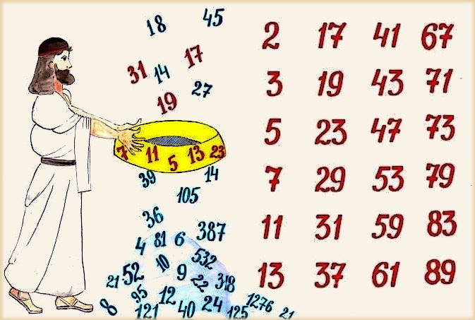
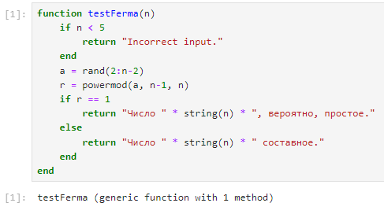
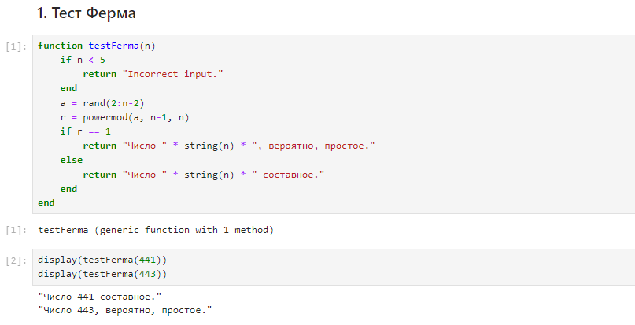
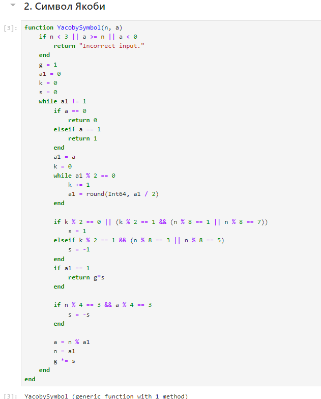
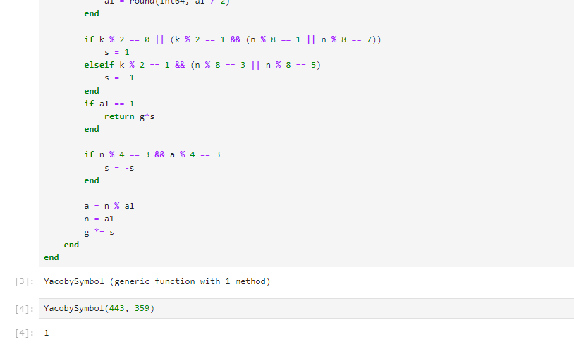
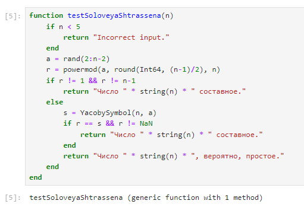
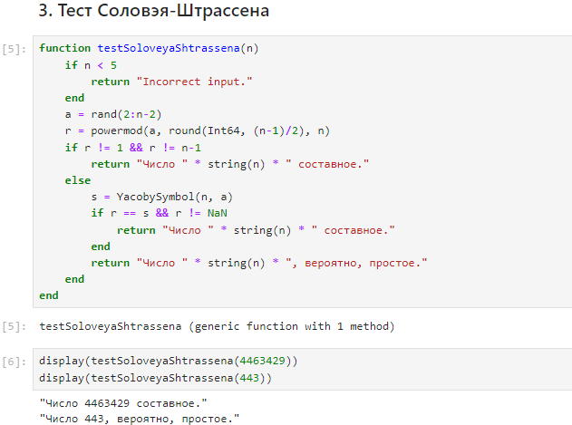
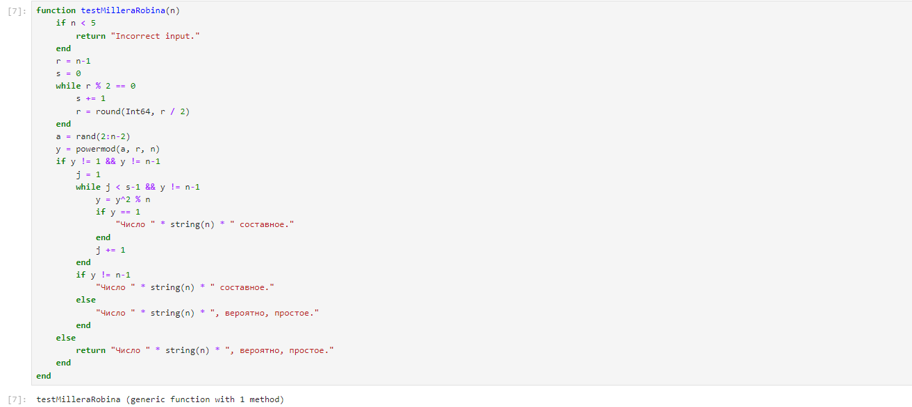
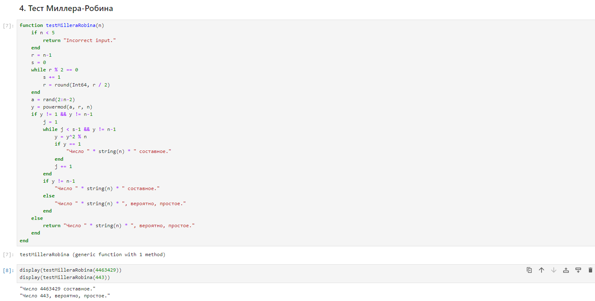

---
## Front matter
lang: ru-RU
title: "Лабораторная работа №5: Вероятностные алгоритмы проверки чисел на простоту"
subtitle: "Дисциплина: Математические основы защиты информации и информационной безопасности"
author: Манаева Варвара Евгеньевна, НФИмд-01-24, 1132249514
institute: Российский университет дружбы народов, Москва, Россия
date: 09 ноября 2024

## i18n babel
babel-lang: russian
babel-otherlangs: english

## Formatting pdf
toc: false
toc-title: Содержание
slide_level: 2
aspectratio: 169
section-titles: true
theme: metropolis
header-includes:
 - \metroset{progressbar=frametitle,sectionpage=progressbar,numbering=fraction}
---

# Общая информация о лабораторной работе

## Цель работы

Ознакомиться с алгоритмами вероятностной проверки чисел на простоту.

## Задание

1. Реализовать тест Ферма;
2. Реализовать алгоритм вычисления символа Якоби;
3. Реализовать тест Соловэя-Штрассена;
4. Реализовать тест Миллера-Робина.

# Теоретическое введение

## Проверки чисел на простоту

:::::::::::::: {.columns align=center}
::: {.column width="50%"}



:::
::: {.column width="50%"}

Существует два типа критериев простоты:

- детерминированные;
- вероятностные.

:::
::::::::::::::

# Выполнение лабораторной работы

# 1. Реализовать тест Ферма

{#fig:011 width=70%}

## Проверка работы функции

```julia
display(testFerma(441))
display(testFerma(443))
```

## Результат выполнения запуска функции шифрования

{#fig:001 width=70%}

# 2. Реализовать алгоритм вычисления символа Якоби

{#fig:012 width=70%}

## Проверка работы функции

```julia
YacobySymbol(443, 359)
```

## Результат выполнения запуска функции шифрования

{#fig:002 width=70%}

# 3. Реализовать тест Соловэя-Штрассена

{#fig:013 width=70%}

## Проверка работы функции

```julia
display(testSoloveyaShtrassena(4463429))
display(testSoloveyaShtrassena(443))
```

## Результат выполнения запуска функции шифрования

{#fig:003 width=70%}

# 4. Реализовать тест Миллера-Робина

{#fig:014 width=70%}

## Проверка работы функции

```julia
display(testMilleraRobina(4463429))
display(testMilleraRobina(443))
```

## Результат выполнения запуска функции шифрования

{#fig:004 width=70%}

# Выводы

В результате работы мы ознакомились с вероятностными алгоритмами проверки чисел на простоту, а именно:

- Тестом Ферма;
- Алгоритмом вычисления символа Якоби;
- Тестом Соловэя-Штрассена;
- Тестом Миллера-Робина.

Были записаны скринкасты:

- выполнения лабораторной работы;
- создания отчёта по результатам выполения лабораторной работы;
- создания презентации по результатам выполнения лабораторной работы;
- защиты лабораторной работы.