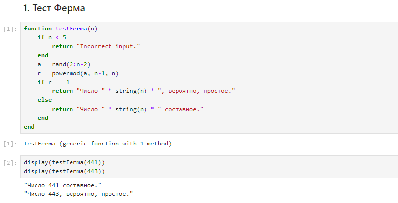
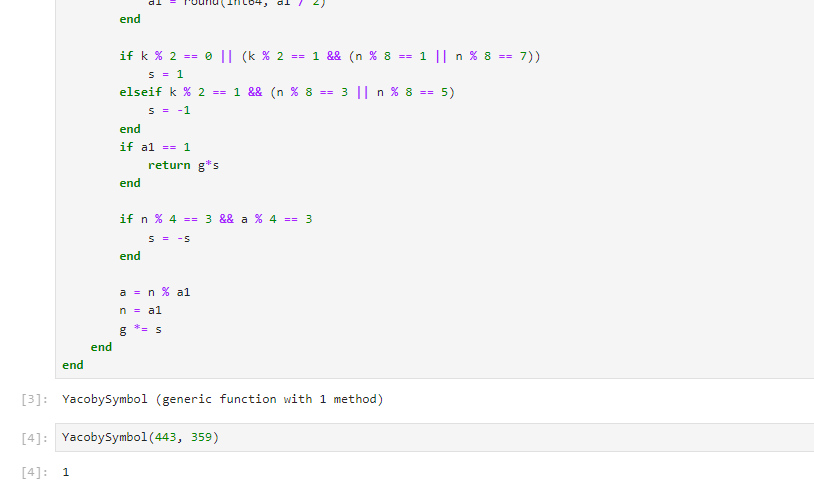
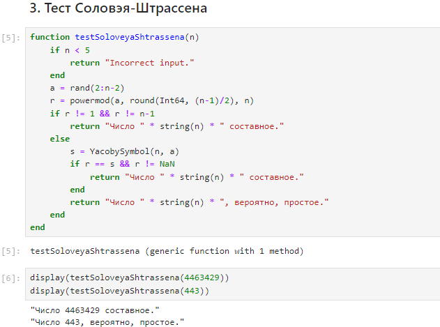
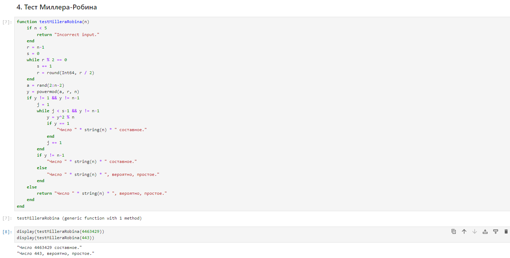

---
## Front matter
title: "Отчёт по лабораторной работе №5: Вероятностные алгоритмы проверки чисел на простоту"
subtitle: "Дисциплина: Математические основы защиты информации и информационной безопасности"
author: "Манаева Варвара Евгеньевна"

## Generic otions
lang: ru-RU
toc-title: "Содержание"

## Bibliography
bibliography: bib/cite.bib
csl: pandoc/csl/gost-r-7-0-5-2008-numeric.csl

## Pdf output format
toc: true # Table of contents
toc-depth: 2
lof: true # List of figures
lot: false # List of tables
fontsize: 12pt
linestretch: 1.5
papersize: a4
documentclass: scrreprt
## I18n polyglossia
polyglossia-lang:
  name: russian
  options:
	- spelling=modern
	- babelshorthands=true
polyglossia-otherlangs:
  name: english
## I18n babel
babel-lang: russian
babel-otherlangs: english
## Fonts
mainfont: IBM Plex Serif
romanfont: IBM Plex Serif
sansfont: IBM Plex Sans
monofont: IBM Plex Mono
mathfont: STIX Two Math
mainfontoptions: Ligatures=Common,Ligatures=TeX,Scale=0.94
romanfontoptions: Ligatures=Common,Ligatures=TeX,Scale=0.94
sansfontoptions: Ligatures=Common,Ligatures=TeX,Scale=MatchLowercase,Scale=0.94
monofontoptions: Scale=MatchLowercase,Scale=0.94,FakeStretch=0.9
mathfontoptions:
## Biblatex
biblatex: true
biblio-style: "gost-numeric"
biblatexoptions:
  - parentracker=true
  - backend=biber
  - hyperref=auto
  - language=auto
  - autolang=other*
  - citestyle=gost-numeric
## Pandoc-crossref LaTeX customization
figureTitle: "Рис."
tableTitle: "Таблица"
listingTitle: "Листинг"
lofTitle: "Список иллюстраций"
lotTitle: "Список таблиц"
lolTitle: "Листинги"
## Misc options
indent: true
header-includes:
  - \usepackage{indentfirst}
  - \usepackage{float} # keep figures where there are in the text
  - \floatplacement{figure}{H} # keep figures where there are in the text
---

# Общая информация о задании лабораторной работы

## Цель работы

Ознакомиться с алгоритмами вероятностной проверки чисел на простоту.

## Задание [@lab-task]

1. Реализовать тест Ферма;
2. Реализовать алгоритм вычисления символа Якоби;
3. Реализовать тест Соловэя-Штрассена;
4. Реализовать тест Миллера-Робина.

# Теоретическое введение [@infobez-course]

## Проверки чисел на простоту

Существует два типа критериев простоты: детерминированные и вероятностные.
Детерминированные тесты позволяют доказать, что тестируемое число - простое.
Практически применимые детерминированные тесты способны дать положительный ответ не для каждого простого числа, поскольку используют лишь достаточные условия простоты.

Детерминированные тесты более полезны, когда необходимо построить большое простое число, а не проверить простоту, скажем, некоторого единственного числа.

На сегодня известно достаточно много алгоритмов проверки чисел на простоту.
Несмотря на то, что большинство из таких алгоритмов имеет субэкспоненциальную оценку сложности, на практике они показывают вполне приемлемую скорость работы.

## Вероятностные проверки чисел на простоту

В отличие от детерминированных, вероятностные тесты можно эффективно использовать для тестирования отдельных чисел,
однако их результаты, с некоторой вероятностью, могут быть неверными. К счастью, ценой количества повторений теста с
модифицированными исходными данными вероятность ошибки можно сделать как угодно малой.

На практике рассмотренные алгоритмы чаще всего по отдельности не применяются.
Для проверки числа на простоту используют либо их комбинации, либо детерминированные тесты на простоту.

Детерминированный алгоритм всегда действует по одной и той же схеме и гарантированно решает поставленную задачу.
Вероятностный алгоритм использует генератор случайных чисел и дает не гарантированно точный ответ.
Вероятностные алгоритмы в общем случае не менее эффективны, чем детерминированные (если используемый генератор
случайных чисел всегда дает набор одних и тех же чисел, возможно, зависящих от входных данных, то вероятностный алгоритм становится детерминированным).

# Выполнение лабораторной работы [@lab-task]

## Реализовать тест Ферма

Информация о задаче.

Исходный код написан на языке `Julia` [@doc-julia]. Код функции, осуществляющей тест Ферма, представлен ниже.

```julia
function testFerma(n)
    if n < 5
        return "Incorrect input."
    end
    a = rand(2:n-2)
    r = powermod(a, n-1, n)
    if r == 1
        return "Число " * string(n) * ", вероятно, простое."
    else
        return "Число " * string(n) * " составное."
    end
end
```

### Проверка работы функции

```julia
display(testFerma(441))
display(testFerma(443))
```

Результат работы кода представлен ниже (рис. [-@fig:001]).

{#fig:001 width=70%}

## Реализовать алгоритм вычисления символа Якоби

Информация о задаче.

Исходный код написан на языке `Julia` [@doc-julia]. Код функции, осуществляющей алгоритм вычисления символа Якоби, представлен ниже.

```julia
function YacobySymbol(n, a)
    if n < 3 || a >= n || a < 0
        return "Incorrect input."
    end
    g = 1
    a1 = 0
    k = 0
    s = 0
    while a1 != 1
        if a == 0
            return 0
        elseif a == 1
            return 1
        end
        a1 = a
        k = 0
        while a1 % 2 == 0
            k += 1
            a1 = round(Int64, a1 / 2)
        end
        
        if k % 2 == 0 || (k % 2 == 1 && (n % 8 == 1 || n % 8 == 7))
            s = 1
        elseif k % 2 == 1 && (n % 8 == 3 || n % 8 == 5)
            s = -1
        end
        if a1 == 1
            return g*s
        end
        
        if n % 4 == 3 && a % 4 == 3
            s = -s
        end
        
        a = n % a1
        n = a1
        g *= s
    end
end
```

### Проверка работы функции

```julia
YacobySymbol(443, 359)
```

Результат работы кода представлен ниже (рис. [-@fig:002]).

{#fig:002 width=70%}

## Реализовать тест Соловэя-Штрассена

Информация о задаче.

Исходный код написан на языке `Julia` [@doc-julia]. Код функции, осуществляющей тест Соловэя-Штрассена, представлен ниже.

```julia
function testSoloveyaShtrassena(n)
    if n < 5
        return "Incorrect input."
    end
    a = rand(2:n-2)
    r = powermod(a, round(Int64, (n-1)/2), n)
    if r != 1 && r != n-1
        return "Число " * string(n) * " составное."
    else
        s = YacobySymbol(n, a)
        if r == s && r != NaN
            return "Число " * string(n) * " составное."
        end
        return "Число " * string(n) * ", вероятно, простое."
    end
end
```

### Проверка работы функции

```julia
display(testSoloveyaShtrassena(4463429))
display(testSoloveyaShtrassena(443))
```

Результат работы кода представлен ниже (рис. [-@fig:003]).

{#fig:003 width=70%}

## Реализовать тест Миллера-Робина

Информация о задаче.

Исходный код написан на языке `Julia` [@doc-julia]. Код функции, осуществляющей тест Миллера-Робина, представлен ниже.

```julia
function testMilleraRobina(n)
    if n < 5
        return "Incorrect input."
    end
    r = n-1
    s = 0
    while r % 2 == 0
        s += 1
        r = round(Int64, r / 2)
    end
    a = rand(2:n-2)
    y = powermod(a, r, n)
    if y != 1 && y != n-1
        j = 1
        while j < s-1 && y != n-1
            y = y^2 % n
            if y == 1
                "Число " * string(n) * " составное."
            end
            j += 1
        end
        if y != n-1
            "Число " * string(n) * " составное."
        else
            "Число " * string(n) * ", вероятно, простое."
        end
    else
        return "Число " * string(n) * ", вероятно, простое."
    end
end
```

### Проверка работы функции

```julia
display(testMilleraRobina(4463429))
display(testMilleraRobina(443))
```

Результат работы кода представлен ниже (рис. [-@fig:004]).

{#fig:004 width=70%}


# Выводы

В результате работы мы ознакомились с вероятностными алгоритмами проверки чисел на простоту, а именно:

- Тестом Ферма;
- Алгоритмом вычисления символа Якоби;
- Тестом Соловэя-Штрассена;
- Тестом Миллера-Робина.

Также были записаны скринкасты:

На RuTube:

- [Весь плейлист](https://rutube.ru/plst/540770)
- [Запись создания шаблона отчёта и презентации для заполнения](https://rutube.ru/video/f2eff0bf79aae34ebe62602bdb92a9b8)
- [Выполнения лабораторной работы](https://rutube.ru/video/013da0866600f00302e04ffcf61e4235)
- [Запись создания отчёта](https://rutube.ru/video/7e62ed6e961df53065735957a2fe1382)
- [Запись создания презентации](https://rutube.ru/video/0aafc1274f90fc8eb2aad7ed783f6f02)
- [Защита лабораторной работы](https://rutube.ru/video/ae91231b95da96bf888c2d23c320421c)

На Платформе:

- [Весь плейлист](https://plvideo.ru/playlist?list=vaNN02mO97J6)
- [Запись создания шаблона отчёта и презентации для заполнения](https://plvideo.ru/watch?v=xAma7VEEbvb-)
- [Выполнения лабораторной работы](https://plvideo.ru/watch?v=zsqbpgNYH4B2)
- [Запись создания отчёта](https://plvideo.ru/watch?v=pqTG5yUhE_Xc)
- [Запись создания презентации](https://plvideo.ru/watch?v=FJYN0Vvib7OA)
- [Защита лабораторной работы](https://plvideo.ru/watch?v=j7tWuC772Uz2)

# Список литературы{.unnumbered}

::: {#refs}
:::
