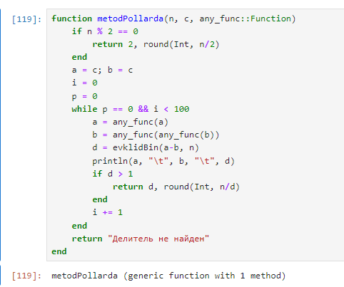
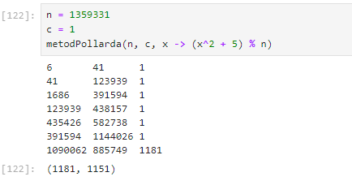
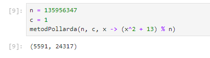

---
## Front matter
lang: ru-RU
title: "Лабораторная работа №6. Разложение числа на множители"
subtitle: "Дисциплина: Математические основы защиты информации и информационной безопасности"
author: Манаева Варвара Евгеньевна, НФИмд-01-24, 1132249514
institute: Российский университет дружбы народов, Москва, Россия
date: 23 ноября 2024

## i18n babel
babel-lang: russian
babel-otherlangs: english

## Formatting pdf
toc: false
toc-title: Содержание
slide_level: 2
aspectratio: 169
section-titles: true
theme: metropolis
header-includes:
 - \metroset{progressbar=frametitle,sectionpage=progressbar,numbering=fraction}
---

# Общая информация о лабораторной работе

## Цель работы

Ознакомиться с алгоритмами разложения числа на множители.

## Задание

1. Реализовать алгоритм разложения чисел на множители;
2. Разложить на множители число.

# Теоретическое введение

## Разложение на множители

pho-метод Полланда (или $\rho-1$ метод Полларда) является одним из алгоритмов для факторизации целых чисел, который особенно эффективен для нахождения малых простых делителей. 
Он основан на свойствах чисел и использует последовательности, чтобы вычислить делители.

## Основные этапы метода

1. Подготовка: 
   - **Выбор числа n:** Начинаем с целого числа n, которое необходимо факторизовать; 
   - **Выбор параметров:** Выбираем небольшое целое число a и границу B, которая будет использоваться для ограничения множителей.
2. Генерация последовательности: Создаем последовательность чисел по формуле: $x_{k+1} = (x_k^2 + a)$.
3. Вычисление НОД: На каждом шаге вычисляем наибольший общий делитель (НОД) между n и разностью двух членов последовательности.
4. Проверка результата: Если найденный НОД d больше 1 и меньше n, то это делитель числа n. Если $d = n$, то алгоритм не дал результата, и его можно повторить с другими параметрами. Если $d=1$, то повторяем действия со второго шага.
5. Завершение: Процесс продолжается до тех пор, пока не будет найден делитель или не исчерпаются все возможные варианты.

## Применение метода

Метод Полланда эффективен для нахождения малых простых делителей, особенно когда число имеет структуру, позволяющую выделить
такие делители. Он также может быть использован в сочетании с другими методами факторизации для повышения общей эффективности.

# Выполнение лабораторной работы

## Реализовать алгоритм разложения числа на множители

{#fig:011 width=70%}

## Работа функции (1)

Разберём подробно работу функции.

На вход функция принимает 3 параметра: 

- `n` -- число, которое необходимо факторизовать;
- `c` -- число, которое используется в качестве начала отсчёта;
- `any_func::Function` -- функция, по которой рассчитывается каждая следующая итерация.

## Работа функции (2)

Функцию саму можно поделить на несколько смысловых частей:

1. Предобработка;
2. Входящие параметры для цикла;
3. Цикл работы функции;
4. Вывод при неудачном наборе входящих данных.

## 1. Предобработка

Если число, которое необходимо факторизовать, делится на 2, то оно не подходит под действие алгоритма (на вход даётся только нечётное число), в связи с чем можно сразу вывести делители
этого числа.

```julia
if n % 2 == 0
    return 2, round(Int, n/2)
end
```

## 2. Входящие параметры для цикла

Первым шагом алгоритма является подготовка двух промежуточных значений (`a` и `b`), которые будут представлять $x_i$ и $x_{2i}$ в рамках работы алгоритма.
Также задаётся счётчик для ограничения числа итераций работы функции.

```julia
a = c; b = c
i = 0
```

## 3. Цикл работы функции

Основный цикл работы функции, включающий в себя шаги 2-4 работы алгоритма.

```julia
while i < 100
    a = any_func(a)
    b = any_func(any_func(b))
    d = evklidBin(a-b, n)
    # println(a, "\t", b, "\t", d)
    if d > 1
        return d, round(Int, n/d)
    end
    i += 1
end
```

## 4. Вывод при неудачном наборе входящих данных

Возвращение значения "Делитель не найден" при завершении работы цикла в связи с превышением числа итераций.

```julia
return "Делитель не найден"
```

## Проверка работы функции

```julia
n = 1359331
c = 1
metodPollarda(n, c, x -> (x^2 + 5) % n)
```

## Результат выполнения запуска функции шифрования

{#fig:001 width=70%}

## 2. Разложить на множители число

{#fig:002 width=70%}

# Выводы

В результате работы мы ознакомились с алгоритмом разложения чисел на множители и реализовали его на языке программирования `Julia`.

Были записаны скринкасты:

- выполнения лабораторной работы;
- создания отчёта по результатам выполения лабораторной работы;
- создания презентации по результатам выполнения лабораторной работы;
- защиты лабораторной работы.
