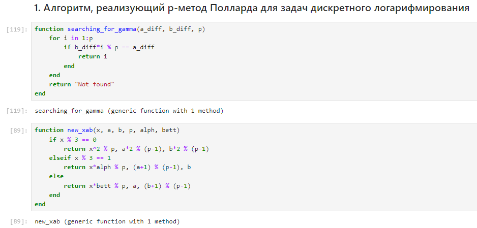
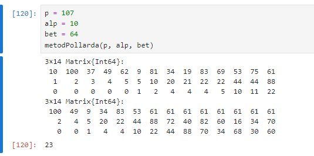
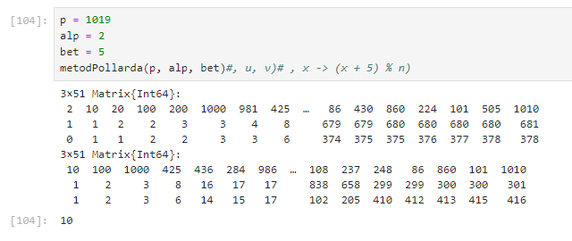

---
## Front matter
lang: ru-RU
title: "Лабораторная работа №7. Дискретное логарифмирование в конечном поле"
subtitle: "Дисциплина: Математические основы защиты информации и информационной безопасности"
author: Манаева Варвара Евгеньевна, НФИмд-01-24, 1132249514
institute: Российский университет дружбы народов, Москва, Россия
date: ?? октября 2024

## i18n babel
babel-lang: russian
babel-otherlangs: english

## Formatting pdf
toc: false
toc-title: Содержание
slide_level: 2
aspectratio: 169
section-titles: true
theme: metropolis
header-includes:
 - \metroset{progressbar=frametitle,sectionpage=progressbar,numbering=fraction}
---

# Общая информация о лабораторной работе

## Цель работы

Ознакомиться с алгоритмом дискретного логарифмирования в конечном поле.

## Задание

1. Реализовать алгоритм дискретного логарифмирования в конечном поле.;
2. Вычислить логарифм с заданными числами $p,a,b$.

# Теоретическое введение

## Конечные поля

:::::::::::::: {.columns align=center}
::: {.column width="50%"}


:::
::: {.column width="50%"}

Среди симметричных шифров выделяют:

- Шифры перестановки;
- Шифры подстановки.

:::
::::::::::::::

# Выполнение лабораторной работы

## Реализовать алгоритм разложения числа на множители

{#fig:011 width=70%}

## Работа функции (1)

Разберём подробно работу функции.

На вход функция принимает 3 параметра: 

- `text` -- исходный текст;
- `gamma_code` -- конечная гамма в виде кодового слова или фразы;
- `isToBeEncoded` -- переменная логического типа, изменяющая поведение работы функции в зависимости от того, был ли наш текст зашифрован до этого или нет.

## Работа функции (2)

Функцию саму можно поделить на несколько смысловых частей:

1. Предобработка данных исходного текста;
2. Предобработка гаммы;
3. Шифровка/расшифровка исходного текста;
4. Вывод функции.

## 1. Функция

Предобработка исходного текста включает в себя фильтрацию от символов, не принадлежащих алфавиту, а также изменение регистра символов.

```julia
# <...>
# Часть функции
# <...>
```

## Проверка работы функции

При проверке корректности реализации важно учитывать, что шифрование гаммированием относится к симметричным шифрам.
Для проверки изначальное сообщение мы пропускаем через функции шифровки и расшифровки с одними и теми же параметрами (кодовым словом, которое играет роль гаммы при шифровании).
Так мы должны получить шифрокод после запуска функции шифрования первый раз, и изначальное сообщение после запуска функции второй раз с теми же параметрами на входе
(исключая собственно параметр функции, задающий направление шифровки/расшифровки).

```julia
# Часть функции
```

## Результат выполнения запуска функции шифрования

{#fig:001 width=70%}

## 2. Вычислить логарифм с заданными числами $p,a,b$

{#fig:002 width=70%}

# Выводы

В результате работы мы ознакомились с алгоритмом дискретного логарифмирования в конечном поле и реализовали его на языке программирования `Julia`.

Были записаны скринкасты:

- выполнения лабораторной работы;
- создания отчёта по результатам выполения лабораторной работы;
- создания презентации по результатам выполнения лабораторной работы;
- защиты лабораторной работы.
