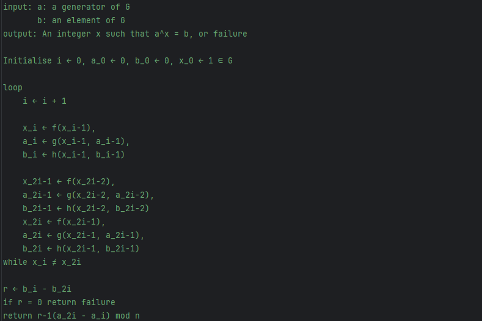
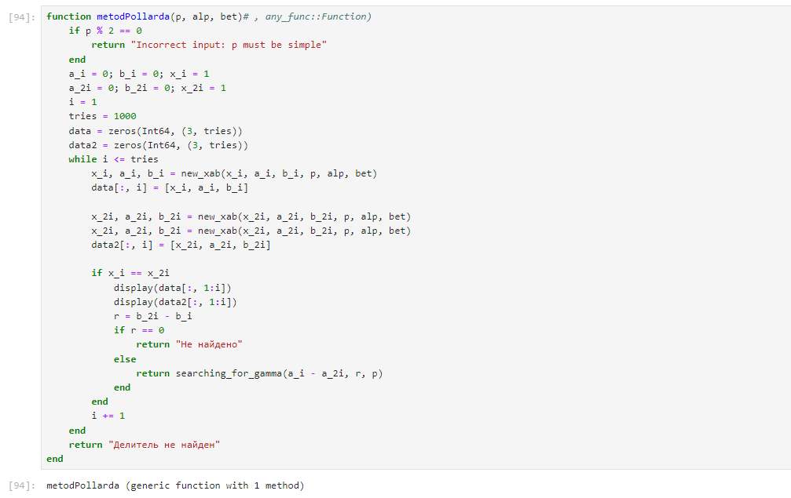

---
## Front matter
lang: ru-RU
title: "Лабораторная работа №7. Дискретное логарифмирование в конечном поле"
subtitle: "Дисциплина: Математические основы защиты информации и информационной безопасности"
author: Манаева Варвара Евгеньевна, НФИмд-01-24, 1132249514
institute: Российский университет дружбы народов, Москва, Россия
date: 07 декабря 2024

## i18n babel
babel-lang: russian
babel-otherlangs: english

## Formatting pdf
toc: false
toc-title: Содержание
slide_level: 2
aspectratio: 169
section-titles: true
theme: metropolis
header-includes:
 - \metroset{progressbar=frametitle,sectionpage=progressbar,numbering=fraction}
---

# Общая информация о лабораторной работе

## Цель работы

Ознакомиться с алгоритмом дискретного логарифмирования в конечном поле.

## Задание

1. Реализовать алгоритм дискретного логарифмирования в конечном поле.;
2. Вычислить логарифм с заданными числами $p,a,b$.

# Теоретическое введение

Дискретный логарифм — это задача нахождения целого числа x по заданным элементам g и y в конечной группе G, такой что:

$$ g^x \equiv y (mod p)$$

где g — основание, y — результат возведения в степень, а p — простое число, определяющее порядок группы.

Алгоритм Полларда основан на методе случайных блужданий и использует принцип "кролика и черепахи" (или "метод Флойда").
Он предполагает, что мы можем генерировать последовательности значений с помощью случайных блужданий и сравнивать их для нахождения совпадений.

## Псевдокод работы алгоритма

{#fig:011 width=70%}

# Выполнение лабораторной работы

## Реализовать алгоритм дискретного логарифмирования (1)

{#fig:011 width=70%}

## Реализовать алгоритм дискретного логарифмирования (2)

{#fig:011 width=70%}

## Проверка работы функции

```julia
p = 1019
alp = 2
bet = 5
metodPollarda(p, alp, bet)

p = 107
alp = 10
bet = 64
metodPollarda(p, alp, bet)
```

## Результат выполнения запуска функции шифрования

{#fig:001 width=70%}

## 2. Вычислить логарифм с заданными числами $p,a,b$

{#fig:002 width=70%}

# Выводы

В результате работы мы ознакомились с алгоритмом дискретного логарифмирования в конечном поле и реализовали его на языке программирования `Julia`.

Были записаны скринкасты:

- выполнения лабораторной работы;
- создания отчёта по результатам выполения лабораторной работы;
- создания презентации по результатам выполнения лабораторной работы;
- защиты лабораторной работы.
