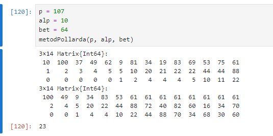
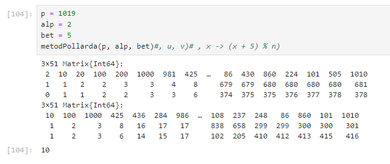

---
## Front matter
title: "Отчёт по лабораторной работе №7. Дискретное логарифмирование в конечном поле"
subtitle: "Дисциплина: Математические основы защиты информации и информационной безопасности"
author: "Манаева Варвара Евгеньевна"

## Generic otions
lang: ru-RU
toc-title: "Содержание"

## Bibliography
bibliography: bib/cite.bib
csl: pandoc/csl/gost-r-7-0-5-2008-numeric.csl

## Pdf output format
toc: true # Table of contents
toc-depth: 2
lof: true # List of figures
lot: false # List of tables
fontsize: 12pt
linestretch: 1.5
papersize: a4
documentclass: scrreprt
## I18n polyglossia
polyglossia-lang:
  name: russian
  options:
	- spelling=modern
	- babelshorthands=true
polyglossia-otherlangs:
  name: english
## I18n babel
babel-lang: russian
babel-otherlangs: english
## Fonts
mainfont: IBM Plex Serif
romanfont: IBM Plex Serif
sansfont: IBM Plex Sans
monofont: IBM Plex Mono
mathfont: STIX Two Math
mainfontoptions: Ligatures=Common,Ligatures=TeX,Scale=0.94
romanfontoptions: Ligatures=Common,Ligatures=TeX,Scale=0.94
sansfontoptions: Ligatures=Common,Ligatures=TeX,Scale=MatchLowercase,Scale=0.94
monofontoptions: Scale=MatchLowercase,Scale=0.94,FakeStretch=0.9
mathfontoptions:
## Biblatex
biblatex: true
biblio-style: "gost-numeric"
biblatexoptions:
  - parentracker=true
  - backend=biber
  - hyperref=auto
  - language=auto
  - autolang=other*
  - citestyle=gost-numeric
## Pandoc-crossref LaTeX customization
figureTitle: "Рис."
tableTitle: "Таблица"
listingTitle: "Листинг"
lofTitle: "Список иллюстраций"
lotTitle: "Список таблиц"
lolTitle: "Листинги"
## Misc options
indent: true
header-includes:
  - \usepackage{indentfirst}
  - \usepackage{float} # keep figures where there are in the text
  - \floatplacement{figure}{H} # keep figures where there are in the text
---

# Общая информация о задании лабораторной работы

## Цель работы

Ознакомиться с алгоритмом дискретного логарифмирования в конечном поле.

## Задание [@lab-task]

1. Реализовать алгоритм дискретного логарифмирования в конечном поле;
2. Вычислить логарифм с заданными числами $p,a,b$.

# Теоретическое введение [@infobez-course]

## Шифры и симметричные шифры

Информация

# Выполнение лабораторной работы [@lab-task]

## Задача

Информация о задаче.

Исходный код написан на языке `Julia` [@doc-julia]. Код функции, осуществляющей алгоритм дискретного логарифмирования в конечном поле, представлен ниже.

```julia
# Собственно функция
```

Разберём подробно работу функции.

На вход функция принимает ? параметра: 

- `text` -- расшифровка.

Функцию саму можно поделить на несколько смысловых частей:

1. Логические части функции.

### 1. Предобработка данных исходного текста

Предобработка исходного текста включает в себя фильтрацию от символов, не принадлежащих алфавиту, а также изменение регистра символов.
Реализовано это с помощью части функции, которая представлена ниже.

```julia
# <...>

# Часть функции

# <...>
```

Расшифровка работы части функции.

### Проверка работы функции

При проверке корректности реализации важно учитывать, что шифрование гаммированием относится к симметричным шифрам.
Для проверки изначальное сообщение мы пропускаем через функции шифровки и расшифровки с одними и теми же параметрами (кодовым словом, которое играет роль гаммы при шифровании).
Так мы должны получить шифрокод после запуска функции шифрования первый раз, и изначальное сообщение после запуска функции второй раз с теми же параметрами на входе
(исключая собственно параметр функции, задающий направление шифровки/расшифровки).

```julia
# Код реализации
```

Результат работы кода представлен ниже (рис. [-@fig:001]).

{#fig:001 width=70%}

## Вычисление логарифма с заданными числами $p,a,b$

```julia
# Код реализации
```

Результат работы кода представлен ниже (рис. [-@fig:002]).

{#fig:002 width=70%}

# Выводы

В результате работы мы ознакомились с алгоритмом дискретного логарифмирования в конечном поле и реализовали его на языке программирования `Julia`.

Также были записаны скринкасты:

На RuTube:

- [Весь плейлист](https://rutube.ru/plst/540770)
- [Запись создания шаблона отчёта и презентации для заполнения](https://rutube.ru/video/f2eff0bf79aae34ebe62602bdb92a9b8)
- [Выполнения лабораторной работы]()
- [Запись создания отчёта]()
- [Запись создания презентации]()
- [Защита лабораторной работы]()

На Платформе:

- [Весь плейлист](https://plvideo.ru/playlist?list=vaNN02mO97J6)
- [Запись создания шаблона отчёта и презентации для заполнения](https://plvideo.ru/watch?v=xAma7VEEbvb-)
- [Выполнения лабораторной работы]()
- [Запись создания отчёта]()
- [Запись создания презентации]()
- [Защита лабораторной работы]()

# Список литературы{.unnumbered}

::: {#refs}
:::
