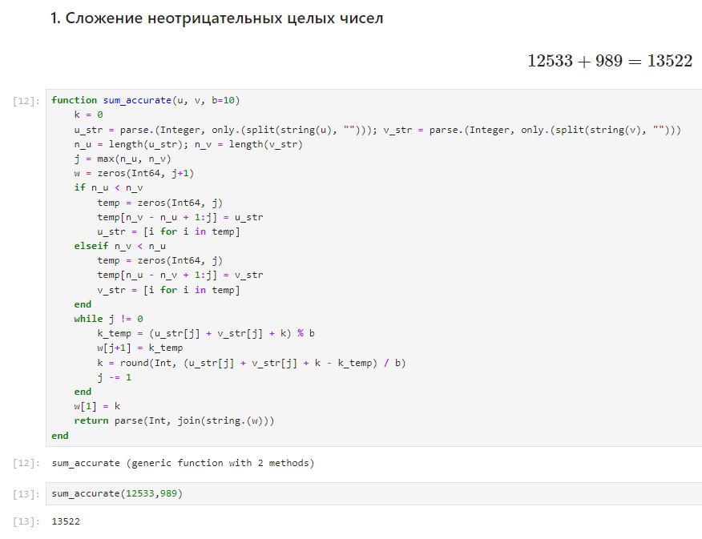

---
## Front matter
lang: ru-RU
title: "Лабораторная работа №8: Целочисленная арифметика многократной точности"
subtitle: "Дисциплина: Математические основы защиты информации и информационной безопасности"
author: Манаева Варвара Евгеньевна, НФИмд-01-24, 1132249514
institute: Российский университет дружбы народов, Москва, Россия
date: 21 декабря 2024

## i18n babel
babel-lang: russian
babel-otherlangs: english

## Formatting pdf
toc: false
toc-title: Содержание
slide_level: 2
aspectratio: 169
section-titles: true
theme: metropolis
header-includes:
 - \metroset{progressbar=frametitle,sectionpage=progressbar,numbering=fraction}
---

# Общая информация о лабораторной работе

## Цель работы

Ознакомиться с целочисленной арифметикой многократной точности.

## Задание

1. Реализовать алгоритмы из задания лабораторной работы.

# Теоретическое введение

В процессе лабораторной работы рассматриваются примеры работы с числами в $b$-ичной системе счисления, $b \ge 2$ -- натуральное число.

Числа для выполнения лабораторной работы будем записывать в виде:

$$
u = u_1u_2u_3\dots u_n.
$$

# Выполнение лабораторной работы

## Алгоритм 1. Сложение неотрицательных целых чисел

{#fig:001 width=70%}

## Алгоритм 2. Вычитание неотрицательных целых чисел

{#fig:002 width=70%}

## Алгоритм 3. Умножение неотрицательных целых чисел

{#fig:003 width=70%}

## Алгоритм 4. Быстрое умножение столбиком

{#fig:004 width=70%}

# Выводы

В результате работы мы ознакомились с целочисленной арифметикой многократной точности и реализовали 4 алгоритма.

Были записаны скринкасты:

- выполнения лабораторной работы;
- создания отчёта по результатам выполения лабораторной работы;
- создания презентации по результатам выполнения лабораторной работы;
- защиты лабораторной работы.
