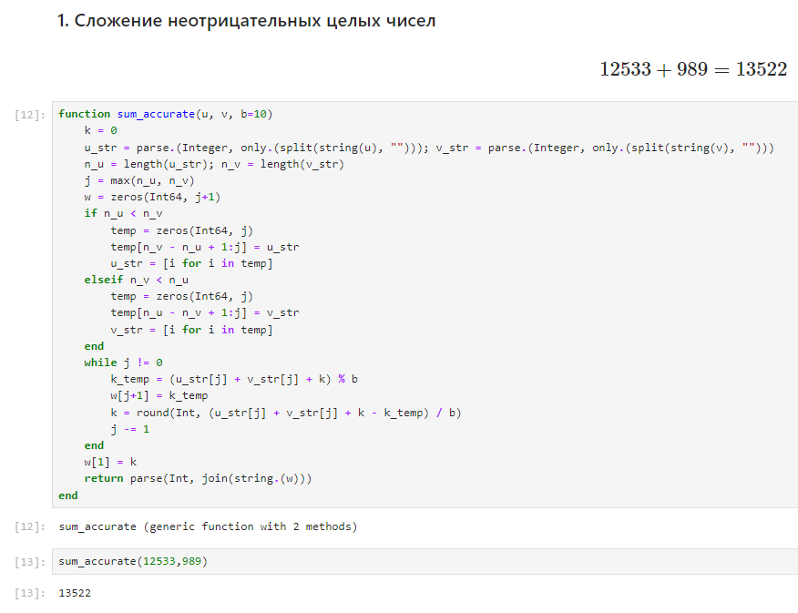
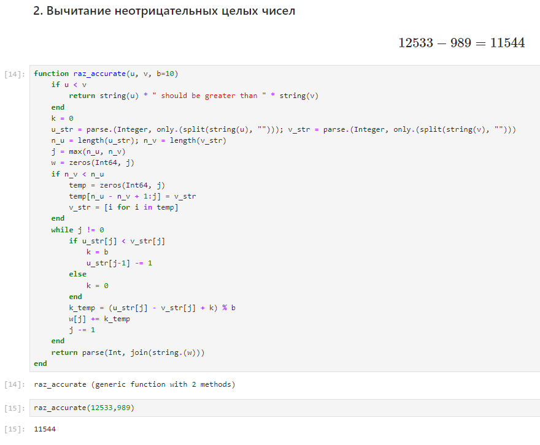
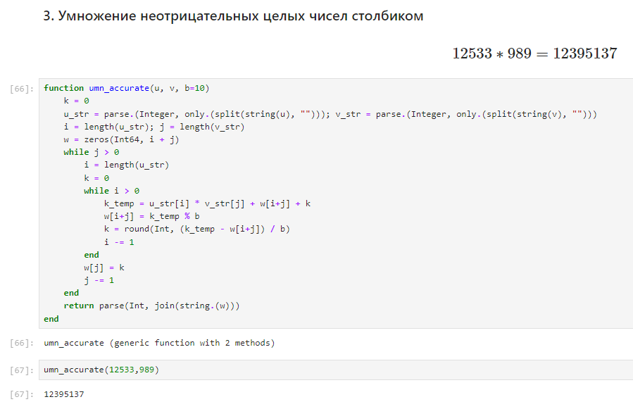
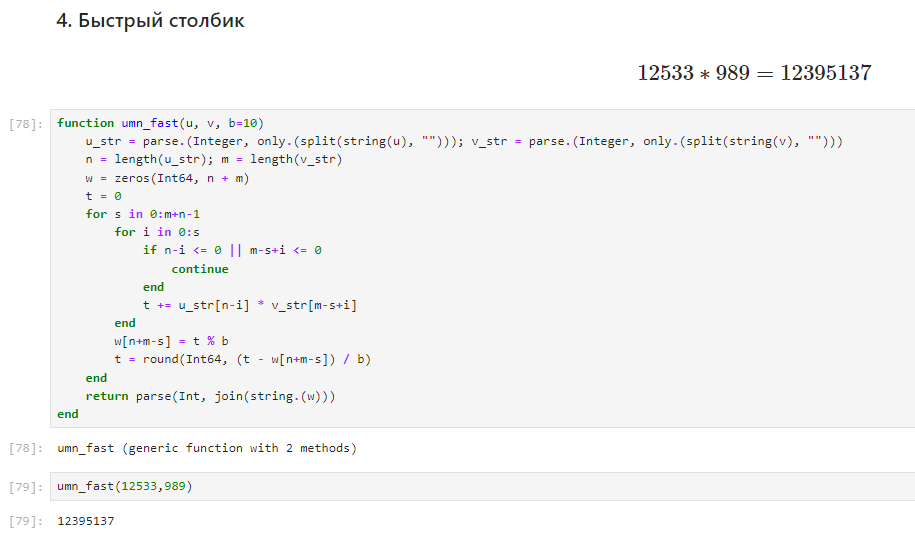

---
## Front matter
title: "Отчёт по лабораторной работе №8: Целочисленная арифметика многократной точности"
subtitle: "Дисциплина: Математические основы защиты информации и информационной безопасности"
author: "Манаева Варвара Евгеньевна"

## Generic otions
lang: ru-RU
toc-title: "Содержание"

## Bibliography
bibliography: bib/cite.bib
csl: pandoc/csl/gost-r-7-0-5-2008-numeric.csl

## Pdf output format
toc: true # Table of contents
toc-depth: 2
lof: true # List of figures
lot: false # List of tables
fontsize: 12pt
linestretch: 1.5
papersize: a4
documentclass: scrreprt
## I18n polyglossia
polyglossia-lang:
  name: russian
  options:
	- spelling=modern
	- babelshorthands=true
polyglossia-otherlangs:
  name: english
## I18n babel
babel-lang: russian
babel-otherlangs: english
## Fonts
mainfont: IBM Plex Serif
romanfont: IBM Plex Serif
sansfont: IBM Plex Sans
monofont: IBM Plex Mono
mathfont: STIX Two Math
mainfontoptions: Ligatures=Common,Ligatures=TeX,Scale=0.94
romanfontoptions: Ligatures=Common,Ligatures=TeX,Scale=0.94
sansfontoptions: Ligatures=Common,Ligatures=TeX,Scale=MatchLowercase,Scale=0.94
monofontoptions: Scale=MatchLowercase,Scale=0.94,FakeStretch=0.9
mathfontoptions:
## Biblatex
biblatex: true
biblio-style: "gost-numeric"
biblatexoptions:
  - parentracker=true
  - backend=biber
  - hyperref=auto
  - language=auto
  - autolang=other*
  - citestyle=gost-numeric
## Pandoc-crossref LaTeX customization
figureTitle: "Рис."
tableTitle: "Таблица"
listingTitle: "Листинг"
lofTitle: "Список иллюстраций"
lotTitle: "Список таблиц"
lolTitle: "Листинги"
## Misc options
indent: true
header-includes:
  - \usepackage{indentfirst}
  - \usepackage{float} # keep figures where there are in the text
  - \floatplacement{figure}{H} # keep figures where there are in the text
---

# Общая информация о задании лабораторной работы

## Цель работы

Ознакомиться с целочисленной арифметикой многократной точности.

## Задание [@lab-task]

1. Реализовать алгоритмы из задания лабораторной работы.

# Выполнение лабораторной работы [@lab-task]

## Алгоритм 1. Сложение неотрицательных целых чисел

Исходный код написан на языке `Julia` [@doc-julia]. Код функции, осуществляющей сложение неотрицательных целых чисел, представлен ниже.

```julia
function sum_accurate(u, v, b=10)
    k = 0
    u_str = parse.(Integer, only.(split(string(u), ""))); v_str = parse.(Integer, only.(split(string(v), "")))
    n_u = length(u_str); n_v = length(v_str)
    j = max(n_u, n_v)
    w = zeros(Int64, j+1)
    if n_u < n_v
        temp = zeros(Int64, j)
        temp[n_v - n_u + 1:j] = u_str
        u_str = [i for i in temp]
    elseif n_v < n_u
        temp = zeros(Int64, j)
        temp[n_u - n_v + 1:j] = v_str
        v_str = [i for i in temp]
    end
    while j != 0
        k_temp = (u_str[j] + v_str[j] + k) % b
        w[j+1] = k_temp
        k = round(Int, (u_str[j] + v_str[j] + k - k_temp) / b)
        j -= 1
    end
    w[1] = k
    return parse(Int, join(string.(w)))
end
```

### Проверка работы функции

```julia
sum_accurate(12533,989)
```

Результат работы кода представлен ниже (рис. [-@fig:001]).

{#fig:001 width=70%}


## Алгоритм 2. Вычитание неотрицательных целых чисел

Исходный код написан на языке `Julia` [@doc-julia]. Код функции, осуществляющей вычитание целых чисел, представлен ниже.

```julia
function raz_accurate(u, v, b=10)
    if u < v
        return string(u) * " should be greater than " * string(v)
    end
    k = 0
    u_str = parse.(Integer, only.(split(string(u), ""))); v_str = parse.(Integer, only.(split(string(v), "")))
    n_u = length(u_str); n_v = length(v_str)
    j = max(n_u, n_v)
    w = zeros(Int64, j)
    if n_v < n_u
        temp = zeros(Int64, j)
        temp[n_u - n_v + 1:j] = v_str
        v_str = [i for i in temp]
    end
    while j != 0
        if u_str[j] < v_str[j]
            k = b
            u_str[j-1] -= 1
        else
            k = 0
        end
        k_temp = (u_str[j] - v_str[j] + k) % b
        w[j] += k_temp
        j -= 1
    end
    return parse(Int, join(string.(w)))
end
```

### Проверка работы функции

```julia
raz_accurate(12533,989)
```

Результат работы кода представлен ниже (рис. [-@fig:002]).

{#fig:002 width=70%}


## Алгоритм 3. Умножение неотрицательных целых чисел

Исходный код написан на языке `Julia` [@doc-julia]. Код функции, осуществляющей умножение неотрицательных чисел, представлен ниже.

```julia
function umn_accurate(u, v, b=10)
    k = 0
    u_str = parse.(Integer, only.(split(string(u), ""))); v_str = parse.(Integer, only.(split(string(v), "")))
    i = length(u_str); j = length(v_str)
    w = zeros(Int64, i + j)
    while j > 0
        i = length(u_str)
        k = 0
        while i > 0
            k_temp = u_str[i] * v_str[j] + w[i+j] + k
            w[i+j] = k_temp % b
            k = round(Int, (k_temp - w[i+j]) / b)
            i -= 1
        end
        w[j] = k
        j -= 1
    end
    return parse(Int, join(string.(w)))
end
```

### Проверка работы функции

```julia
umn_accurate(12533,989)
```

Результат работы кода представлен ниже (рис. [-@fig:003]).

{#fig:003 width=70%}


## Алгоритм 4. Быстрое умножение столбиком

Исходный код написан на языке `Julia` [@doc-julia]. Код функции, осуществляющей быстрое умножение столбиком, представлен ниже.

```julia
function umn_fast(u, v, b=10)
    u_str = parse.(Integer, only.(split(string(u), ""))); v_str = parse.(Integer, only.(split(string(v), "")))
    n = length(u_str); m = length(v_str)
    w = zeros(Int64, n + m)
    t = 0
    for s in 0:m+n-1
        for i in 0:s
            if n-i <= 0 || m-s+i <= 0
                continue
            end
            t += u_str[n-i] * v_str[m-s+i]
        end
        w[n+m-s] = t % b
        t = round(Int64, (t - w[n+m-s]) / b)
    end
    return parse(Int, join(string.(w)))
end
```

### Проверка работы функции

```julia
umn_fast(12533,989)
```

Результат работы кода представлен ниже (рис. [-@fig:004]).

{#fig:004 width=70%}

# Выводы

В результате работы мы ознакомились с целочисленной арифметикой многократной точности.

Также были записаны скринкасты:

На RuTube:

- [Весь плейлист](https://rutube.ru/plst/540770)
- [Запись создания шаблона отчёта и презентации для заполнения](https://rutube.ru/video/f2eff0bf79aae34ebe62602bdb92a9b8)
- [Выполнения лабораторной работы](https://rutube.ru/video/702914c96130907b2c10014e01e35a83)
- [Запись создания отчёта](https://rutube.ru/video/078597536c1b0cd543c09ea6d9dff0e5/)
- [Запись создания презентации](https://rutube.ru/video/0301607c8f2f30b42639e7629a1ae2d4)
- [Защита лабораторной работы](https://rutube.ru/video/6d11d4bf50b3a1bbc63f0af210783a90/)

На Платформе:

- [Весь плейлист](https://plvideo.ru/playlist?list=vaNN02mO97J6)
- [Запись создания шаблона отчёта и презентации для заполнения](https://plvideo.ru/watch?v=xAma7VEEbvb-)
- [Выполнения лабораторной работы](https://plvideo.ru/watch?v=cmOkt1N2P1pk)
- [Запись создания отчёта](https://plvideo.ru/watch?v=glc_k6Jx9Bkg)
- [Запись создания презентации](https://plvideo.ru/watch?v=jSH3ZzgFrArk)
- [Защита лабораторной работы](https://plvideo.ru/watch?v=yVpnvSIMQIIv)

# Список литературы{.unnumbered}

::: {#refs}
:::
